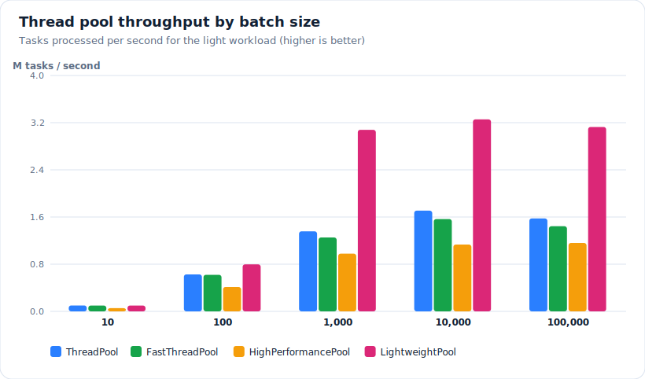
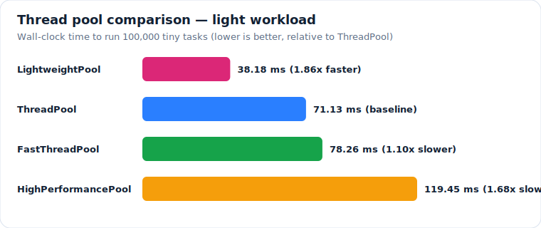
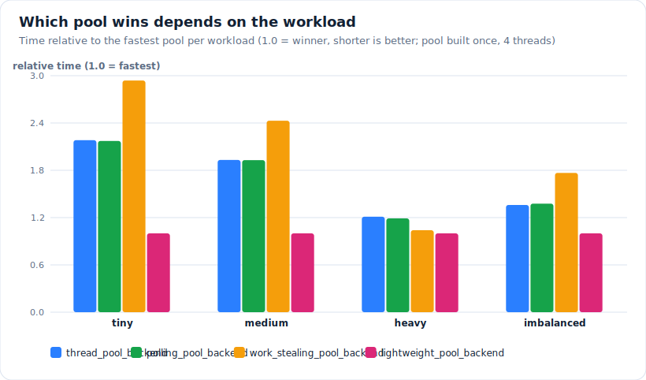
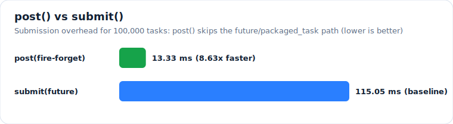
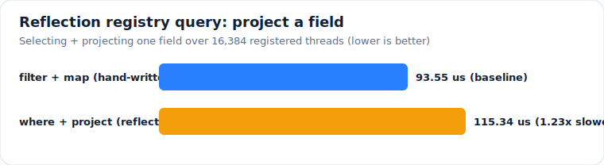
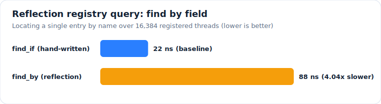
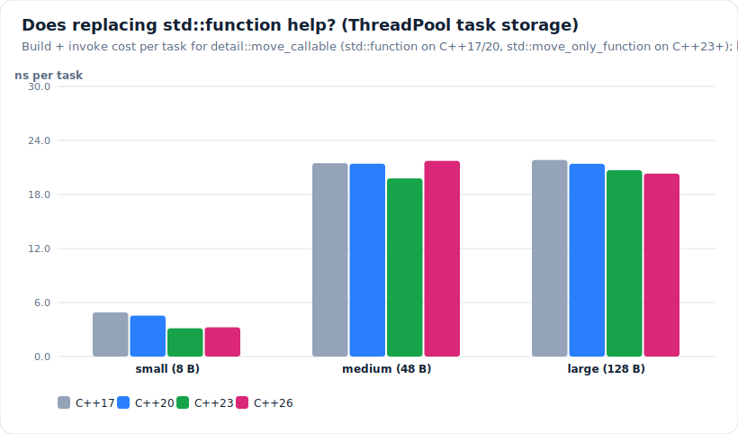
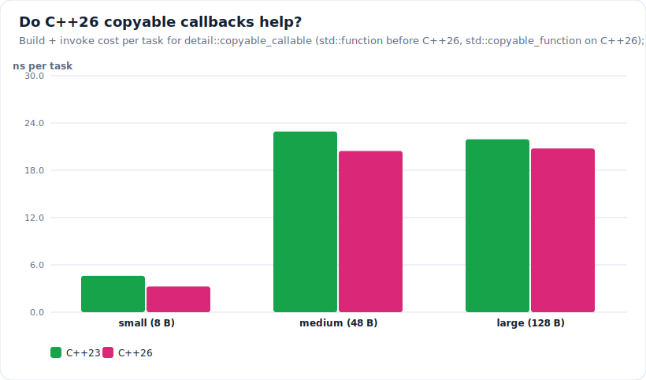
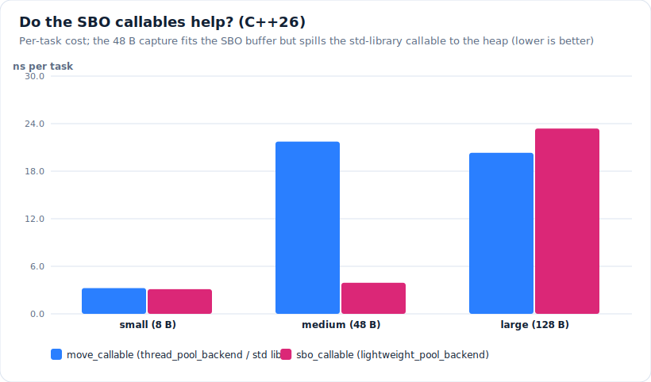

# ThreadSchedule

[](https://github.com/Katze719/ThreadSchedule/actions/workflows/tests.yml)
[](https://github.com/Katze719/ThreadSchedule/actions/workflows/integration.yml)
[](https://github.com/Katze719/ThreadSchedule/actions/workflows/registry-integration.yml)
[](https://github.com/Katze719/ThreadSchedule/actions/workflows/runtime-tests.yml)
[](https://github.com/Katze719/ThreadSchedule/actions/workflows/documentation.yml)
[](LICENSE)

A modern C++ library for advanced thread management on Linux and Windows.
ThreadSchedule provides enhanced wrappers for `std::thread`, `std::jthread`, and
`pthread` with extended functionality including thread naming, priority
management, CPU affinity, and high-performance thread pools.

Available as **header-only**, as a **C++20 module** (`import threadschedule;`),
or with optional **shared runtime** for multi-DSO applications.

## Key Features

- **Modern C++**: Full C++17, C++20, C++23, and C++26 support with automatic
  feature detection and optimization
- **C++20 Modules**: Optional `import threadschedule;` support (C++20+)
- **Header-Only or Shared Runtime**: Choose based on your needs
- **Enhanced Wrappers**: Extend `std::thread`, `std::jthread`, and `pthread`
  with powerful features
- **Non-owning Views**: Zero-overhead views to configure existing threads or
  find by name (Linux)
- **`ThreadInfo` Handles**: Lightweight bound thread handles for the current
  thread or any known `Tid`
- **Thread Naming**: Human-readable thread names for debugging
- **Priority & Scheduling**: Fine-grained control over thread priorities and
  scheduling policies
- **CPU Affinity**: Pin threads to specific CPU cores
- **Global Control Registry**: Process-wide registry to list and control running
  threads (affinity, priority, name)
- **Profiles**: High-level presets for priority/policy/affinity
- **NUMA-aware Topology Helpers**: Easy affinity builders across nodes
- **Chaos Testing**: RAII controller to perturb affinity/priority for validation
- **C++20 Coroutines**: `task<T>`, `generator<T>`, and `sync_wait` out of the
  box - no boilerplate promise types needed
- **High-Performance Pools**: Work-stealing pool, `post()` / `try_post()`, and
  optional `LightweightPool` for fire-and-forget workloads with minimal overhead
- **Modern Callable Paths**: Newer standard libraries can use
  `std::move_only_function` / `std::copyable_function` internally for lower
  adaptation overhead while keeping the public API source-compatible
- **GCC 16 Reflection APIs**: Optional C++26 reflection utilities and
  reflection-backed registry queries when building with GCC 16+ and
  `-freflection`
- **Scheduled Tasks**: Run tasks at specific times, after delays, or
  periodically
- **Error Handling**: Comprehensive exception handling with error callbacks and
  context
- **Performance Metrics**: Built-in statistics and monitoring
- **RAII & Exception Safety**: Automatic resource management
- **Multiple Integration Methods**: CMake, CPM, Conan, FetchContent

## What's new in v2.2

Version 2.2 focuses on **broader thread-control coverage**, **more modern
callable handling on newer standards**, and **wider C++26 CI coverage**.
Highlights:

| Area                         | What changed                                                                                                                                                                                                 |
| ---------------------------- | ------------------------------------------------------------------------------------------------------------------------------------------------------------------------------------------------------------ |
| **`ThreadInfo`**             | `ThreadInfo` can now bind a specific `Tid`, not just the current thread. Use it to query or configure name, priority, policy, and affinity for library-owned background threads or other known thread IDs. |
| **Background thread control**| `ScheduledThreadPoolT` exposes `scheduler_thread_info()` / `configure_scheduler_thread(...)`, and `ChaosController` exposes `thread_info()` / `configure_thread(...)`.                                      |
| **Callable modernization**   | Internal task/callback storage is feature-gated: move-only hot paths can use `std::move_only_function`, reusable hooks can use `std::copyable_function`, and older toolchains keep the `std::function` path. |
| **Move-only task support**   | `post`/`try_post`, one-shot scheduled tasks, pthread entry trampolines, and error-handling wrappers now accept more move-only payloads cleanly on newer standard libraries.                                 |
| **Tests & benchmarks**       | New regression tests cover move-only tasks/callbacks and invalid `ThreadInfo(Tid)` targets. A new `callable_benchmarks` target compares small, large, and move-only task capture overhead.                |
| **CI**                       | Linux C++26 coverage now includes `gcc-16` and `clang-22` in addition to the existing modern compiler jobs.                                                                                                |

## What's new in v2.0

Version 2.0 focuses on **lower-overhead submission**, **more control over
shutdown and tuning**, and **better ergonomics** for modern C++ (ranges,
coroutines, `std::stop_token`). Highlights:

| Area                        | What changed                                                                                                                                                                                                                                                         |
| --------------------------- | -------------------------------------------------------------------------------------------------------------------------------------------------------------------------------------------------------------------------------------------------------------------- |
| **Lightweight pool**        | `LightweightPoolT<TaskSize>` / `LightweightPool` - fire-and-forget only, configurable SBO buffer (default 64 B), no futures or stats. Workers are still `ThreadWrapper` (name, affinity, policy). Ideal for maximum throughput when you do not need a return value. |
| **`post()` / `try_post()`** | On `HighPerformancePool`, `ThreadPool` / `FastThreadPool`, and `GlobalPool` - same queue path as `submit()` but skips `packaged_task` / `future` overhead.                                                                                                          |
| **Non-throwing submit**     | `try_submit()` returns `expected<future<R>, error_code>`; `try_submit_batch()` returns `expected<vector<future<void>>, error_code>` instead of throwing on shutdown.                                                                                                  |
| **Scheduled dispatch**      | `ScheduledThreadPoolT` dispatches with `post()` internally. Alias `ScheduledLightweightPool` uses `LightweightPool` as the backend.                                                                                                                                  |
| **Shutdown**                | `ShutdownPolicy::drain` (default) vs `drop_pending`; `shutdown_for(timeout)` for a timed drain.                                                                                                                                                                      |
| **Parallel loops**          | Chunked `parallel_for_each` on all pool types (shared helper across single-queue and work-stealing pools).                                                                                                                                                           |
| **Tuning**                  | `PollingWait<IntervalMs>` for `FastThreadPool`, configurable work-stealing deque capacity on `HighPerformancePool`, `GlobalPool::init(n)` before first use.                                                                                                          |
| **C++20**                   | Ranges overloads for batch submit and `parallel_for_each`; `submit`/`try_submit` with `std::stop_token` (cooperative skip).                                                                                                                                          |
| **Futures**                 | `when_all`, `when_any`, `when_all_settled` in `futures.hpp`.                                                                                                                                                                                                         |
| **Coroutines**              | `schedule_on{pool}`, `pool_executor`, `run_on(pool, coro_fn)` for pool-aware `task`.                                                                                                                                                                                 |
| **Observability**           | Optional auto-registration of pool workers in the thread registry; per-task `set_on_task_start` / `set_on_task_end` hooks.                                                                                                                                           |
| **Errors**                  | `ErrorHandler` callbacks get stable IDs; `remove_callback(id)` / `has_callback(id)`.                                                                                                                                                                                 |

See <a href="CHANGELOG.md">CHANGELOG.md</a> for the full list, including breaking changes
when upgrading from v1.x.

**Upgrading from v1.x:** [Migration guide (v2.0)](docs/MIGRATION_V2.md)

## Documentation

- **[Migrating to v2.0](docs/MIGRATION_V2.md)** - Breaking changes, renames, and
  recommended follow-ups from v1.x
- **[Integration Guide](docs/INTEGRATION.md)** - CMake, Conan, FetchContent,
  system installation
- **[Thread Registry Guide](docs/REGISTRY.md)** - Process-wide thread control
  and multi-DSO patterns
- **[Scheduled Tasks Guide](docs/SCHEDULED_TASKS.md)** - Timer and periodic task
  scheduling
- **[Error Handling Guide](docs/ERROR_HANDLING.md)** - Exception handling with
  callbacks
- **[CMake Reference](docs/CMAKE_REFERENCE.md)** - Build options, targets, and
  troubleshooting
- **[Profiles](docs/PROFILES.md)** - High-level presets for
  priority/policy/affinity
- **[Topology & NUMA](docs/TOPOLOGY_NUMA.md)** - NUMA-aware affinity builders
- **[Chaos Testing](docs/CHAOS_TESTING.md)** - RAII controller to perturb
  affinity/priority for validation
- **[Coroutines](docs/COROUTINES.md)** - C++20 `task<T>`, `generator<T>`, and
  `sync_wait`
- **Feature Roadmap** - Current features and future plans (see below)

## Platform Support

ThreadSchedule is designed to work on any platform with a C++17 (or newer)
compiler and standard threading support. The library is **continuously tested**
on:

| Platform            | Compiler           | C++17 | C++20 | C++23 | C++26 |
| ------------------- | ------------------ | :---: | :---: | :---: | :---: |
| **Linux (x86_64)**  |                    |       |       |       |       |
| Ubuntu 22.04        | GCC 11             |  yes   |  yes   |  yes   |   -   |
| Ubuntu 22.04        | GCC 12             |   -   |  yes   |   -   |   -   |
| Ubuntu 22.04        | Clang 14           |  yes   |  yes   |  yes   |   -   |
| Ubuntu 22.04        | Clang 15           |   -   |  yes   |  yes   |   -   |
| Ubuntu 24.04        | GCC 13             |  yes   |  yes   |  yes   |   -   |
| Ubuntu 24.04        | GCC 14             |  yes   |  yes   |  yes   |  yes   |
| Ubuntu 24.04        | GCC 15             |   -   |  yes   |  yes   |  yes   |
| Ubuntu 24.04        | GCC 16             |   -   |   -   |   -   |  yes   |
| Ubuntu 24.04        | Clang 16           |  yes   |  yes   |   -   |   -   |
| Ubuntu 24.04        | Clang 18           |  yes   |  yes   |   -   |   -   |
| Ubuntu 24.04        | Clang 19           |   -   |  yes   |  yes   |  yes   |
| Ubuntu 24.04        | Clang 21           |   -   |  yes   |  yes   |  yes   |
| Ubuntu 24.04        | Clang 22           |   -   |   -   |   -   |  yes   |
| **Linux (ARM64)**   |                    |       |       |       |       |
| Ubuntu 24.04 ARM64  | GCC 13 (system)    |  yes   |  yes   |  yes   |   -   |
| Ubuntu 24.04 ARM64  | GCC 14             |   -   |  yes   |  yes   |  yes   |
| **Windows**         |                    |       |       |       |       |
| Windows Server 2022 | MSVC 2022          |  yes   |  yes   |  yes   |   -   |
| Windows Server 2022 | MinGW-w64 (GCC 15) |  yes   |  yes   |  yes   |   -   |
| Windows Server 2025 | MSVC 2022          |  yes   |  yes   |  yes   |   -   |
| Windows Server 2025 | MinGW-w64 (GCC 15) |  yes   |  yes   |  yes   |   -   |

**Additional platforms:** ThreadSchedule should work on other platforms (macOS,
FreeBSD, other Linux distributions) with standard C++17+ compilers, but these
are not regularly tested in CI.

> **C++23**: GCC 12's libstdc++ lacks monadic `std::expected` operations
> (`and_then`, `transform`, ...). Clang 16/18 on Ubuntu 24.04 use GCC 14's
> libstdc++ headers which expose `std::expected` incorrectly to those Clang
> versions. These combinations are therefore only tested up to C++20.
>
> **C++26**: Requires GCC 14+ or Clang 19+. MSVC does not yet expose
> `cxx_std_26` to CMake; C++26 on Windows is not tested.
>
> **Reflection APIs**: The optional `threadschedule::reflect` API and
> reflection-backed registry queries require GCC 16+ with
> `THREADSCHEDULE_ENABLE_REFLECTION=ON`. These APIs are not built on other
> toolchains or standards.
>
> **GCC 15**: Installed via `ppa:ubuntu-toolchain-r/test` on Ubuntu 24.04.
>
> **GCC 16**: Installed via `ppa:ubuntu-toolchain-r/test` on Ubuntu 24.04.
>
> **Clang 21**: Installed via the official LLVM apt repository (`apt.llvm.org`)
> on Ubuntu 24.04.
>
> **Clang 22**: Installed via the official LLVM apt repository (`apt.llvm.org`)
> on Ubuntu 24.04.
>
> **Windows ARM64**: Not currently covered by GitHub-hosted runners, requires
> self-hosted runner for testing.
>
> **MinGW**: MinGW-w64 (MSYS2) ships GCC 15 and provides full Windows API
> support including thread naming (Windows 10+).

## Quick Start

### Installation

Add to your CMakeLists.txt using
[CPM.cmake](https://github.com/cpm-cmake/CPM.cmake):

```cmake
include(${CMAKE_BINARY_DIR}/cmake/CPM.cmake)

CPMAddPackage(
    NAME ThreadSchedule
    GITHUB_REPOSITORY Katze719/ThreadSchedule
    GIT_TAG main  # or specific version tag
    OPTIONS "THREADSCHEDULE_BUILD_EXAMPLES OFF" "THREADSCHEDULE_BUILD_TESTS OFF"
)

add_executable(your_app src/main.cpp)
target_link_libraries(your_app PRIVATE ThreadSchedule::ThreadSchedule)
```

**Other integration methods:** See [docs/INTEGRATION.md](docs/INTEGRATION.md)
for FetchContent, Conan, system installation, and shared runtime option.

### C++20 Module Usage

ThreadSchedule can also be consumed as a C++20 module (requires CMake 3.28+ and
Ninja or Visual Studio 17.4+):

```cmake
# In your CMakeLists.txt
set(CMAKE_CXX_STANDARD 20)

CPMAddPackage(
    NAME ThreadSchedule
    GITHUB_REPOSITORY Katze719/ThreadSchedule
    GIT_TAG main
    OPTIONS "THREADSCHEDULE_MODULE ON"
)

add_executable(your_app src/main.cpp)
target_link_libraries(your_app PRIVATE ThreadSchedule::Module)
```

```cpp
// src/main.cpp
import threadschedule;

int main() {
    ts::HighPerformancePool pool(4);
    auto future = pool.submit([]() { return 42; });
    return future.get() != 42;
}
```

### Basic Usage

```cpp
#include <threadschedule/threadschedule.hpp>

using namespace threadschedule;

int main() {
    // Enhanced thread with configuration
    ThreadWrapper worker([]() {
        std::cout << "Worker running!" << std::endl;
    });
    worker.set_name("my_worker");
    worker.set_priority(ThreadPriority::normal());
    
    // High-performance thread pool
    HighPerformancePool pool(4);
    pool.configure_threads("worker");
    pool.distribute_across_cpus();
    
    auto future = pool.submit([]() { return 42; });
    std::cout << "Result: " << future.get() << std::endl;

    // Fire-and-forget (no future): post() on any pool, or LightweightPool
    pool.post([]() { /* work */ });
    LightweightPool lite(4);
    lite.configure_threads("lite");
    lite.post([]() { /* minimal overhead */ });
    
    // Scheduled tasks (uses ThreadPool by default)
    ScheduledThreadPool scheduler(4);
    auto handle = scheduler.schedule_periodic(std::chrono::seconds(5), []() {
        std::cout << "Periodic task executed!" << std::endl;
    });
    scheduler.configure_scheduler_thread("sched_main");
    
    // Or use high-performance pool for frequent tasks
    ScheduledHighPerformancePool scheduler_hp(4);
    auto handle_hp = scheduler_hp.schedule_periodic(std::chrono::milliseconds(100), []() {
        std::cout << "Frequent task!" << std::endl;
    });

    // Bound thread handle for library-owned threads
    if (auto info = scheduler.scheduler_thread_info()) {
        (void)info->set_priority(ThreadPriority::normal());
    }

    // Move-only payloads on modern standard libraries
    auto payload = std::make_unique<int>(7);
    pool.post([value = std::move(payload)]() mutable {
        std::cout << "Move-only payload: " << *value << std::endl;
    });

    // v2: ScheduledLightweightPool - same API, LightweightPool backend (post-based dispatch)
    
    // Error handling
    HighPerformancePoolWithErrors pool_safe(4);
    pool_safe.add_error_callback([](const TaskError& error) {
        std::cerr << "Task error: " << error.what() << std::endl;
    });
    
    return 0;
}
```

### Non-owning Thread Views

Operate on existing threads without owning their lifetime.

```cpp
#include <threadschedule/threadschedule.hpp>
using namespace threadschedule;

std::thread t([]{ /* work */ });

// Configure existing std::thread
ThreadWrapperView v(t);
v.set_name("worker_0");
v.set_affinity(ThreadAffinity({0}));
v.join(); // joins the underlying t
```

#### Using thread views with APIs expecting std::thread/std::jthread references

- Views do not own threads. Use `.get()` to pass a reference to APIs that expect
  `std::thread&` or (C++20) `std::jthread&`.
- Ownership stays with the original `std::thread`/`std::jthread` object.

```cpp
void configure(std::thread& t);

std::thread t([]{ /* work */ });
ThreadWrapperView v(t);
configure(v.get()); // non-owning reference
```

You can also pass threads directly to APIs that take views; the view is created
implicitly (non-owning):

```cpp
void operate(threadschedule::ThreadWrapperView v);

std::thread t2([]{});
operate(t2); // implicit, non-owning
```

`std::jthread` (C++20):

```cpp
std::jthread jt([](std::stop_token st){ /* work */ });
JThreadWrapperView jv(jt);
jv.set_name("jworker");
jv.request_stop();
jv.join();
```

### `ThreadInfo` for Bound Thread IDs

Use `ThreadInfo` when you already know a `Tid` and want a lightweight control
handle without wrapping ownership.

```cpp
#include <threadschedule/threadschedule.hpp>
using namespace threadschedule;

ScheduledThreadPool scheduler(2);

if (auto info = scheduler.scheduler_thread_info()) {
    auto tid = info->thread_id();
    ThreadInfo bound(tid);
    (void)bound.set_name("scheduler_main");
    auto current_name = bound.get_name();
}
```

### Global Thread Registry

Opt-in registered threads with process-wide control, without imposing overhead
on normal wrappers.

```cpp
#include <threadschedule/registered_threads.hpp>
#include <threadschedule/thread_registry.hpp>
using namespace threadschedule;

int main() {
    // Opt-in registration via *Reg wrapper
    ThreadWrapperReg t("worker-1", "io", [] {
        // ... work ...
    });

    // Chainable query API - direct filter and apply operations
    registry()
        .filter([](const RegisteredThreadInfo& e){ return e.componentTag == "io"; })
        .for_each([&](const RegisteredThreadInfo& e){
            (void)registry().set_name(e.tid, std::string("io-")+e.name);
            (void)registry().set_priority(e.tid, ThreadPriority{0});
        });
    
    // Count threads by tag
    auto io_count = registry()
        .filter([](const RegisteredThreadInfo& e){ return e.componentTag == "io"; })
        .count();
    
    // Check if any IO threads exist
    bool has_io = registry().any([](const RegisteredThreadInfo& e){ return e.componentTag == "io"; });
    
    // Find specific thread
    auto found = registry().find_if([](const RegisteredThreadInfo& e){ return e.name == "worker-1"; });
    
    // Map to extract TIDs
    auto tids = registry().filter(...).map([](auto& e) { return e.tid; });

    t.join();
}
```

**For multi-DSO applications:** Use the shared runtime option
(`THREADSCHEDULE_RUNTIME=ON`) to ensure a single process-wide registry. See
[docs/REGISTRY.md](docs/REGISTRY.md) for detailed patterns.

Notes:

- Normal wrappers (`ThreadWrapper`, `JThreadWrapper`, `PThreadWrapper`) remain
  zero-overhead.
- The registry **requires control blocks** for all operations. Threads must be
  registered with control blocks to be controllable via the registry.
- Use `*Reg` wrappers (e.g., `ThreadWrapperReg`) or `AutoRegisterCurrentThread`
  for automatic control block creation and registration.

### Reflection-powered registry queries (GCC 16+ / C++26)

When `THREADSCHEDULE_ENABLE_REFLECTION=ON` is active on GCC 16+ with
`-std=c++26`, ThreadSchedule exposes field metadata and faster field-oriented
registry queries.

```cpp
#include <threadschedule/threadschedule.hpp>
using namespace threadschedule;

auto io_names =
    registry()
        .where<registered_thread_fields::componentTag()>("io")
        .project<registered_thread_fields::name()>();

auto live_compute =
    registry()
        .where<registered_thread_fields::componentTag()>("compute")
        .where_if<registered_thread_fields::alive()>([](bool alive) {
            return alive;
        })
        .project<registered_thread_fields::tid(), registered_thread_fields::name()>();

bool has_scheduler = registry().contains<registered_thread_fields::name()>("sched_main");
```

You can also inspect reflected library types directly:

```cpp
#include <threadschedule/threadschedule.hpp>
using namespace threadschedule;

static_assert(reflect::field_count<RegisteredThreadInfo>() == 6);
static_assert(reflect::field_name<RegisteredThreadInfo, 2>() == "name");

ThreadProfile profile = profiles::throughput();
reflect::visit_fields(profile, [](std::string_view field, auto const& value) {
    // inspect compile-time-described fields at runtime
});
```

Find by name (Linux):

```cpp
ThreadByNameView by_name("th_1");
if (by_name.found()) {
    by_name.set_name("new_name");
    ThreadAffinity one_core; one_core.add_cpu(0);
    by_name.set_affinity(one_core);
}
```

### Error handling with expected

ThreadSchedule uses `threadschedule::expected<T, std::error_code>` (and
`expected<void, std::error_code>`). When available, this aliases to
`std::expected`, otherwise, a compatible fallback based on
[P0323R3](https://www.open-std.org/jtc1/sc22/wg21/docs/papers/2017/p0323r3.pdf)
is used.

> Note: when building with `-fno-exceptions`, behavior is not
> standard-conforming because `value()`/`operator*` cannot throw
> `bad_expected_access` on error (exceptions are disabled). In that mode, always
> check `has_value()` or use `value_or()` before accessing the value.

Recommended usage:

```cpp
auto r = worker.set_name("my_worker");
if (!r) {
    // Inspect r.error() (std::error_code)
}

auto value = pool.submit([]{ return 42; }); // standard future-based API remains unchanged
```

### Coroutines (C++20)

Lazy coroutine primitives - no boilerplate promise types required.

```cpp
#include <threadschedule/threadschedule.hpp>
using namespace threadschedule;

// Lazy single-value coroutine
task<int> compute(int x) {
    co_return x * 2;
}

task<int> pipeline() {
    int a = co_await compute(21);  // lazy - starts here
    co_return a;                   // 42
}

int main() {
    // Blocking bridge for synchronous code
    int result = sync_wait(pipeline());

    // Lazy sequence coroutine
    auto fib = []() -> generator<int> {
        int a = 0, b = 1;
        while (true) {
            co_yield a;
            auto tmp = a; a = b; b = tmp + b;
        }
    };

    for (int v : fib()) {
        if (v > 1000) break;
        std::cout << v << "\n";
    }
}
```

**For more details:** See the [Coroutines Guide](docs/COROUTINES.md).

## API Overview

### Thread Wrappers

| Class            | Description                                                   | Available On   |
| ---------------- | ------------------------------------------------------------- | -------------- |
| `ThreadWrapper`  | Enhanced `std::thread` with naming, priority, affinity        | Linux, Windows |
| `JThreadWrapper` | Enhanced `std::jthread` with cooperative cancellation (C++20) | Linux, Windows |
| `PThreadWrapper` | Modern C++ interface for POSIX threads                        | Linux only     |

#### Passing wrappers into APIs expecting std::thread/std::jthread

- `std::thread` and `std::jthread` are move-only. When an API expects
  `std::thread&&` or `std::jthread&&`, pass the underlying thread via
  `release()` from the wrapper.
- Avoid relying on implicit conversions; `release()` clearly transfers ownership
  and prevents accidental selection of the functor constructor of `std::thread`.

```cpp
void accept_std_thread(std::thread&& t);

ThreadWrapper w([]{ /* work */ });
accept_std_thread(w.release()); // move ownership of the underlying std::thread
```

- Conversely, you can construct wrappers from rvalue threads:

```cpp
void take_wrapper(ThreadWrapper w);

std::thread make_thread();
take_wrapper(make_thread());       // implicit move into ThreadWrapper

std::thread t([]{});
take_wrapper(std::move(t));        // explicit move into ThreadWrapper
```

### Thread Views (non-owning)

Zero-overhead helpers to operate on existing threads without taking ownership.

| Class                | Description                                  | Available On   |
| -------------------- | -------------------------------------------- | -------------- |
| `ThreadWrapperView`  | View over an existing `std::thread`          | Linux, Windows |
| `JThreadWrapperView` | View over an existing `std::jthread` (C++20) | Linux, Windows |
| `ThreadByNameView`   | Locate and control a thread by its name      | Linux only     |

### Thread Pools

| Class                 | Use Case                                      | Notes                                                                  |
| --------------------- | --------------------------------------------- | ---------------------------------------------------------------------- |
| `ThreadPool`          | Single shared queue, blocks while idle        | `submit`, `try_submit`, `post`, batches, `parallel_for_each`           |
| `FastThreadPool`      | Same as `ThreadPool` with polling wait policy | Tunable via `PollingWait<IntervalMs>`                                  |
| `HighPerformancePool` | Work-stealing + overflow queue                | Highest throughput for large batches; tunable deque capacity           |
| `LightweightPool`     | Fire-and-forget only, SBO tasks               | No futures; use `post` / `post_batch`. Alias of `LightweightPoolT<64>` |

All of the above support `shutdown(ShutdownPolicy)` and `shutdown_for(timeout)`
where applicable. Use **`post()`** when you do not need a `std::future` (lower
overhead than `submit()`). On newer standard libraries, internal queueing and
hook/error-callback storage can transparently use standard move-only/copyable
call wrappers.

### Configuration

```cpp
// Scheduling policies
SchedulingPolicy::OTHER    // Standard time-sharing
SchedulingPolicy::FIFO     // Real-time FIFO
SchedulingPolicy::RR       // Real-time round-robin
SchedulingPolicy::BATCH    // Batch processing
SchedulingPolicy::IDLE     // Low priority background

// Priority management
ThreadPriority::lowest()   // Minimum priority
ThreadPriority::normal()   // Default priority
ThreadPriority::highest()  // Maximum priority
ThreadPriority(value)      // Custom priority

// CPU affinity
ThreadAffinity affinity({0, 1, 2});  // Pin to CPUs 0, 1, 2
worker.set_affinity(affinity);
```

**For more details:** See the [Integration Guide](docs/INTEGRATION.md),
[Registry Guide](docs/REGISTRY.md), and
[CMake Reference](docs/CMAKE_REFERENCE.md) linked at the top of this README.

### Benchmark Results

Performance varies by system configuration, workload characteristics, and task
complexity. The charts below were captured in a single environment; reproduce
them on your own machine with `./run_benchmark_graphs.sh` (HTML report) or
regenerate the SVGs with `benchmarks/generate_readme_graphs.py`.

<details>
<summary><strong>Benchmark environment & build flags</strong></summary>

| Setting          | Value                                                                 |
| ---------------- | --------------------------------------------------------------------- |
| CPU              | AMD Ryzen 5 5600X (6 cores / 12 threads, 32 MiB L3, up to ~4.65 GHz)   |
| OS / kernel      | Fedora 44, Linux 7.0.4-200.fc44.x86_64                                 |
| Compiler         | GCC 16.1.1 (`-std=c++23` for the pool charts; C++17/20/23/26 for the callable charts) |
| Build type       | `Release` (`-O3 -DNDEBUG`)                                             |
| Extra flags      | `-march=native -ffast-math -fno-omit-frame-pointer`                   |
| Google Benchmark | v1.9.4                                                                 |
| Threads          | 4 worker threads unless noted                                         |

The exact compile flags used for every benchmark target (see
[`benchmarks/CMakeLists.txt`](benchmarks/CMakeLists.txt)):

```bash
# GCC / Clang
-O3 -DNDEBUG -fno-omit-frame-pointer -march=native -ffast-math
# plus the C++ standard: -std=c++23 (pool/reflection charts),
#                         -std=c++17 / 20 / 23 / 26 (callable charts)
```

> Absolute numbers are only meaningful relative to each other on the **same**
> machine and build. `-march=native` and `-ffast-math` in particular mean results
> are not comparable across CPUs. Re-run the benchmarks locally before drawing
> conclusions for your hardware.

</details>

**Throughput scales with batch size.** For tiny tasks the
fire-and-forget `LightweightPool` consistently leads, while the work-stealing
`HighPerformancePool` pays for its extra machinery and only shines on larger,
unbalanced workloads:



**Pick the right pool for the workload.** Running 100,000 trivial tasks, the
`LightweightPool` finishes ~1.9x faster than the baseline `ThreadPool`, whereas
the work-stealing pool is slower because the tasks are too small to benefit from
stealing:



**The gap depends heavily on how much work each task does.** With the pool built
once and the per-task work swept from `tiny` to `heavy`, the picture changes: for
tiny/medium tasks submission overhead dominates and `LightweightPool` wins by
~2-3x, but as the per-task work grows the field converges to within ~20% and the
pool choice stops mattering much. The work-stealing `HighPerformancePool` climbs
from last place (tiny) to nearly the front (heavy):



**Skip the future when you do not need it.** `post()` reuses the same queue path
as `submit()` but avoids the `packaged_task` / `std::future` overhead, which is
dramatic for very short tasks:



> These numbers measure submission/scheduling overhead with light tasks, so they
> represent a worst case for pool overhead. As the "workload weights" chart
> shows, real workloads with heavier per-task work narrow these gaps
> considerably.

#### Reflection-backed registry queries (GCC 16+ / C++26)

With `THREADSCHEDULE_ENABLE_REFLECTION=ON` the registry exposes ergonomic,
field-oriented queries (`where` / `project` / `find_by`). These trade a little
performance for readability and compile-time field checking: against
hand-written STL-style lambdas over 16,384 registered threads they currently run
slightly slower, so reach for them when expressiveness matters more than the last
few percent of throughput.





#### Task storage: `std::move_only_function` and SBO callables

The pools store type-erased tasks in one of two ways: `ThreadPool` /
`FastThreadPool` / `HighPerformancePool` use `detail::move_callable`
(`std::function` on C++17/20, `std::move_only_function` on C++23+), while
`LightweightPool` uses a custom small-buffer callable (`SboCallable<64>`). The
`callable_std_benchmarks` target isolates the build + invoke cost of these
wrappers (away from thread-scheduling noise) and is compiled under every standard.

**Does replacing `std::function` help?** For small captures, switching to
`std::move_only_function` on C++23+ cuts the per-task wrapper cost by ~30%
(~4.6 ns to ~3.1 ns). For larger captures the heap allocation dominates and the
wrapper choice barely matters:



**Do C++26 copyable callbacks help?** Yes, for the callback-heavy APIs that
still need copyable type erasure (`set_on_task_start`, `set_on_task_end`,
registry hooks, and error callbacks). On this GCC 16.1 / libstdc++ setup,
switching from `std::function` to `std::copyable_function` cuts wrapper cost by
about 29% for small captures, 11% for medium captures, and 5% for large ones:



**Do the SBO callables help?** Yes — and this is the bigger effect. A 48-byte
capture fits `LightweightPool`'s 56-byte inline buffer but overflows the
standard-library callables' small buffer, so the latter heap-allocate. The SBO
path is then ~6x faster (~3.4 ns vs ~21 ns per task). Once a capture is too big
for any inline buffer (128 B), both allocate and the advantage disappears:



<details>
<summary><strong>How big is a task, really? (capture sizes &amp; inline buffers)</strong></summary>

A task is usually a lambda, and **a lambda's size is the sum of what it captures**
(plus alignment padding). A capture-less lambda is effectively free; each captured
pointer or reference adds 8 bytes, and capturing objects *by value* adds their
full size. Concrete sizes on this platform (GCC 16 / libstdc++, x86_64):

| What the task captures                              | Example                                  | Size   |
| --------------------------------------------------- | ---------------------------------------- | ------ |
| nothing (stateless)                                 | `pool.post([]{ tick(); });`              | ~1 B   |
| one pointer / reference / `this`                    | `pool.post([&q]{ q.drain(); });`         | 8 B    |
| two pointers / references                           | `pool.post([&a, &b]{ join(a, b); });`    | 16 B   |
| a `std::shared_ptr` by value                        | `pool.post([h]{ h->run(); });`           | 16 B   |
| a `std::vector` by value                            | `pool.post([data]{ process(data); });`   | 24 B   |
| a `std::string` by value                            | `pool.post([name]{ log(name); });`       | 32 B   |
| ~6 small values / handles (the chart's "medium")    | `pool.post([id,a,b,c,d,e]{ ... });`      | 48 B   |
| a big array / struct by value (the chart's "large") | `pool.post([frame]{ encode(frame); });`  | 128 B  |

Each storage type keeps small callables **inline** (no allocation) up to a fixed
buffer size, and falls back to a heap allocation above it:

| Storage                       | Inline buffer | Used by                                   |
| ----------------------------- | ------------- | ----------------------------------------- |
| `std::function`               | ≤ 16 B        | `ThreadPool` family on C++17/20           |
| `std::move_only_function`     | ≤ 24 B        | `ThreadPool` family on C++23+             |
| `SboCallable<64>`             | ≤ 56 B        | `LightweightPool` (`= LightweightPoolT<64>`) |

`SboCallable<TaskSize>` lays each task out as one cache line:

```
  |<------------- TaskSize = 64 B ------------->|
  [ vtable* (8 B) | inline capture buffer (56 B) ]
```

**Typical real tasks capture a few pointers/handles plus maybe a small value, so
they land in the ~8-48 B range.** That fits `LightweightPool`'s 56 B buffer with
no allocation, but overflows `std::function`'s 16 B buffer (one allocation per
task). If you capture large objects by value you blow past every inline buffer -
capture a pointer/handle to the data instead, or bump the buffer with
`LightweightPoolT<128>`.

</details>

> Takeaway: keep task captures small. They stay inline (no allocation) in
> `LightweightPool`, and on C++23+ the other pools also benefit from the
> move-only wrapper. This is exactly why `post()` and `LightweightPool` are the
> recommended low-overhead paths.

See [benchmarks/](benchmarks/) for detailed performance analysis, real-world
scenario testing, and optimization recommendations.

## Platform-Specific Features

### Linux

- Full `pthread` API support
- Real-time scheduling policies (FIFO, RR, DEADLINE)
- CPU affinity and NUMA control
- Nice values for process priority

### Windows

- Thread naming (Windows 10 1607+)
- Thread priority classes
- CPU affinity masking
- Process priority control

**Note**: `PThreadWrapper` is Linux-only. Use `ThreadWrapper` or
`JThreadWrapper` for cross-platform code.

## Contributing

Contributions are welcome! Please:

1. Fork the repository
2. Create a feature branch (`git checkout -b feature/amazing-feature`)
3. Commit your changes with clear messages
4. Push to your branch (`git push origin feature/amazing-feature`)
5. Open a Pull Request

## License

This project is licensed under the MIT License - see the [LICENSE](LICENSE) file
for details.

## Acknowledgments

- POSIX threads documentation
- Modern C++ threading best practices
- Linux kernel scheduling documentation
- C++20/23/26 concurrency improvements
