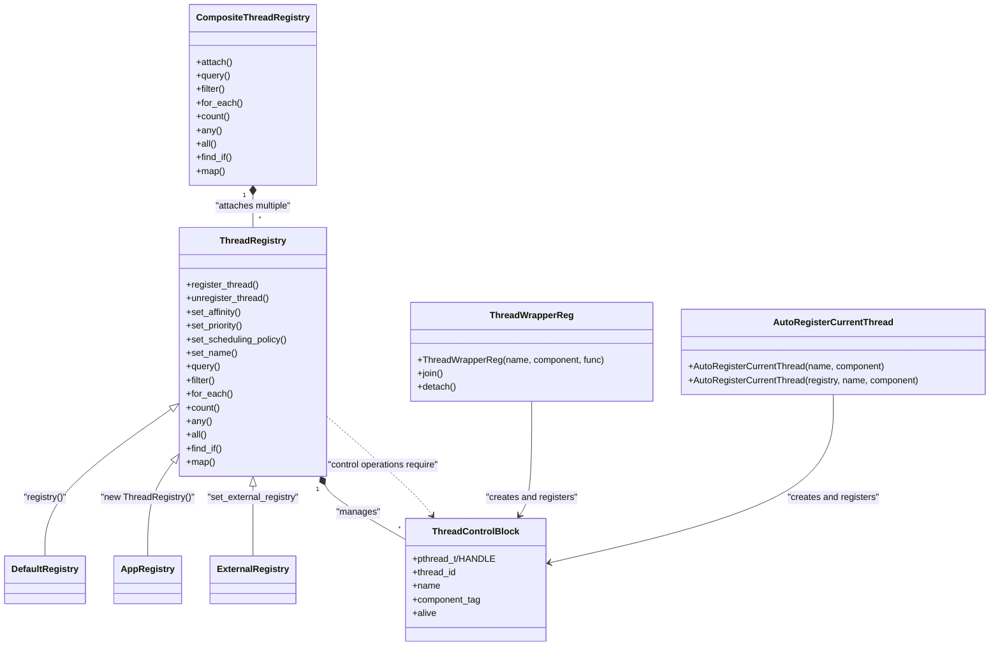
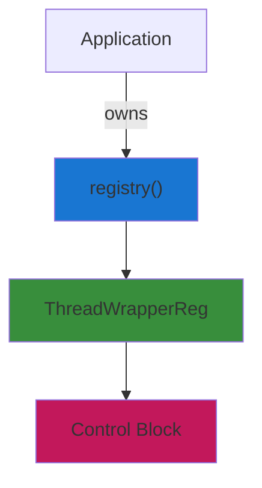
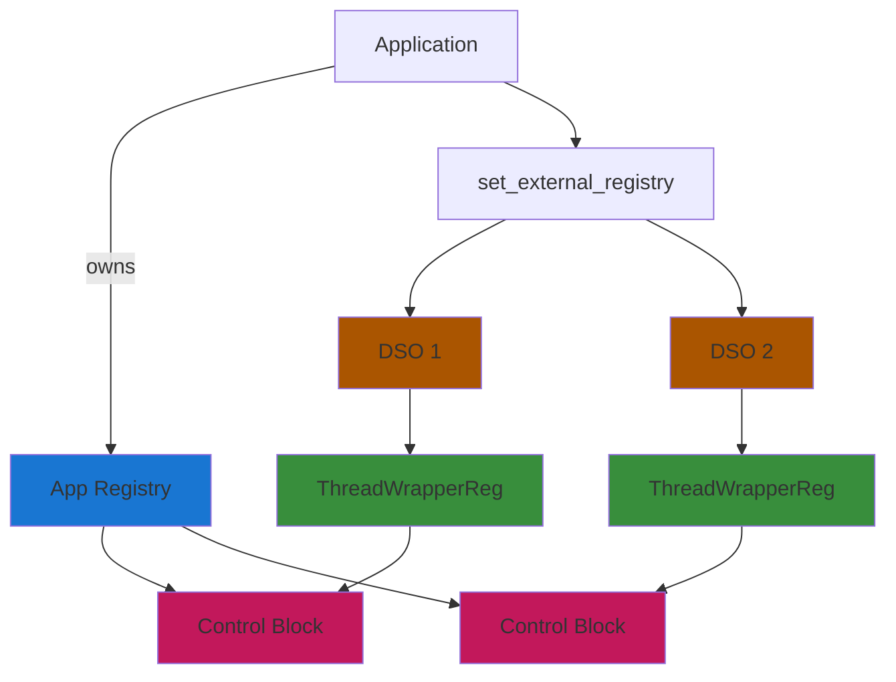
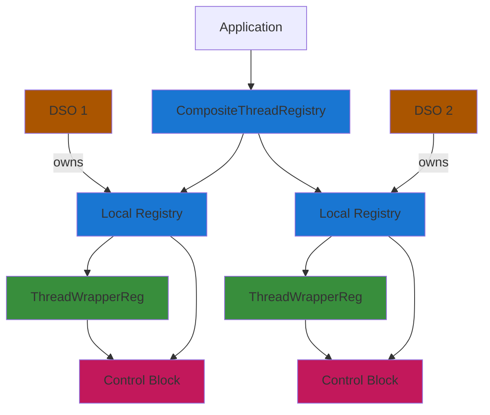
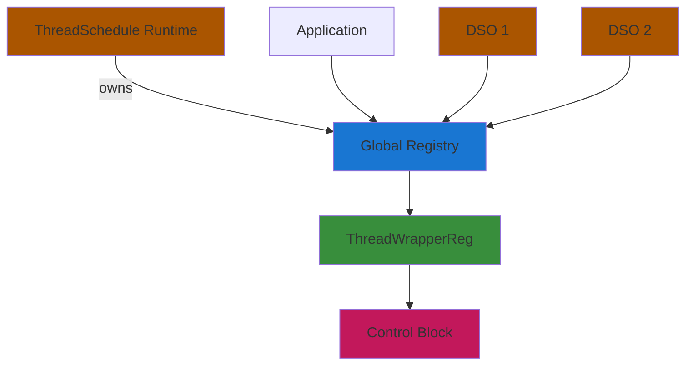

## Thread Registry Usage Guide

This guide explains how to use the process-wide thread registry in common scenarios, including multiple shared libraries (DSOs) using ThreadSchedule.

### What is the registry?

The registry provides a process-wide view of running threads and APIs to control them (affinity, priority, scheduling policy, name). It is header-only by default (with an optional shared runtime), opt-in, and compatible with both Linux and Windows.

### Registry Architecture Overview



**Key Components:**

- **ThreadRegistry**: Core registry implementation that manages thread information and control operations
- **CompositeThreadRegistry**: Merges multiple registries into a unified view (useful for multiple DSOs)
- **ThreadControlBlock**: Platform-specific control structure (pthread_t on Linux, HANDLE on Windows)
- **ThreadWrapperReg**: Thread wrapper that automatically creates and registers control blocks
- **AutoRegisterCurrentThread**: RAII helper for registering existing threads

**Creation Patterns:**
- **Default Registry**: `registry()` returns a singleton instance
- **App Registry**: `new ThreadRegistry()` creates application-owned instance
- **External Registry**: `set_external_registry` injects app registry as global
- **Runtime Registry**: Shared library provides single process-wide instance

### Usage Scenarios

#### 1. Single Application



**Pattern**: Direct use of `registry()` singleton

#### 2. Multiple DSOs - App Injection



**Pattern**: App creates registry, injects into all DSOs via `set_external_registry`

#### 3. Multiple DSOs - Composite Registry



**Pattern**: Each DSO has isolated registry, app merges views with `CompositeThreadRegistry`

**Note**: Uses `ThreadWrapperReg` for automatic thread registration in each DSO's local registry

#### 4. Runtime Mode



**Pattern**: Shared library provides single process-wide registry

### Timeline:
- **Header-only Mode**: Default registry created on first `registry()` call
- **Runtime Mode**: Shared runtime created at startup, provides global registry instance

- Core entrypoints:
  - `threadschedule::registry()` – default global registry
  - `threadschedule::set_external_registry(...)` – app-injected global registry
  - `threadschedule::CompositeThreadRegistry` – merge multiple registries (views)
  - `threadschedule::AutoRegisterCurrentThread` – RAII auto-registration
  - `threadschedule::ThreadWrapperReg` – opt-in wrapper that auto-registers

**Important:** The registry **requires control blocks** for all control operations (`set_affinity`, `set_priority`, `set_scheduling_policy`, `set_name`). Threads registered without control blocks can be queried but not controlled. Use `ThreadWrapperReg` or `AutoRegisterCurrentThread` to automatically create and register control blocks.

### When to use which pattern?

- Single app, single shared ThreadSchedule: Use `registry()` directly. Create `ThreadWrapperReg` threads or use `AutoRegisterCurrentThread` in worker entry.
- App with multiple DSOs that also include ThreadSchedule:
  - Preferred: Ensure all components link against the same `libthreadschedule` (shared). `registry()` resolves to the same instance.
  - If components statically include ThreadSchedule: Use `set_external_registry(&appRegistry)` in `main()` and register threads to that instance everywhere.
  - If isolated registries are desired for components: Each component uses its own `ThreadRegistry`, and the app merges them using `CompositeThreadRegistry`.

### Header-only builds and multiple DSOs

Because ThreadSchedule is header-only, each DSO that includes it may get its own internal `registry()` singleton. To obtain a unified process-wide view, use one of these patterns:

- App injection (unify to a single app-owned registry)
  - The app creates a `ThreadRegistry appReg;` and injects it into itself and into every DSO using a small setter exported by each DSO.

DSO side (libX):

```cpp
// libX_api.cpp
#include <threadschedule/thread_registry.hpp>
using namespace threadschedule;

// Allow the host application to inject a registry pointer
void libX_set_registry(ThreadRegistry* reg) {
  set_external_registry(reg);
}
```

App side:

```cpp
#include <threadschedule/thread_registry.hpp>
using namespace threadschedule;

// From each DSO's public header
void libA_set_registry(ThreadRegistry*);
void libB_set_registry(ThreadRegistry*);

int main() {
  ThreadRegistry appReg;
  // App uses the same registry for its own calls
  set_external_registry(&appReg);
  // Propagate the same pointer into all DSOs
  libA_set_registry(&appReg);
  libB_set_registry(&appReg);
  // ... start threads in app and DSOs ...
}
```

- Composite merge (keep DSOs isolated and merge views in the app)
  - Each DSO exposes `ThreadRegistry& libX_registry();` and registers its threads into that local registry. The app builds a `CompositeThreadRegistry` and attaches all of them. See example below.

- Dynamic discovery (no headers)
  - On POSIX, you can `dlsym` exported symbols (e.g., `libX_registry`, `libX_set_registry`) from each DSO at runtime and call them to either attach or inject a registry pointer.

### Single shared runtime (optional, non header-only mode)

If you prefer a single, process-wide registry without app-side injection or composite merging, enable the runtime option. This builds a shared library that owns the global registry and exports the required symbols.

- Enable in CMake:

```bash
cmake -B build -DTHREADSCHEDULE_RUNTIME=ON
cmake --build build
```

- Link your app and DSOs against the runtime target:

```cmake
target_link_libraries(your_app PRIVATE ThreadSchedule::ThreadSchedule ThreadSchedule::Runtime)
target_link_libraries(your_dso PRIVATE ThreadSchedule::ThreadSchedule ThreadSchedule::Runtime)
```

- Exported APIs (same as header-only), provided by the runtime:
  - `threadschedule::registry()` – returns the single process-wide registry instance
  - `threadschedule::set_external_registry(ThreadRegistry*)` – optionally redirect runtime to an app-owned instance

Notes:
- With `THREADSCHEDULE_RUNTIME=ON`, the header declares these functions and the `.so/.dll` provides the definitions.
- This ensures all components in the process resolve to the same registry object as long as they link to the runtime.
- You can still call `set_external_registry(&appReg)` early in `main()` to make the app’s instance authoritative.

### Examples

#### 1) Basic app usage with the default registry

**New chainable API (recommended):**
```cpp
#include <threadschedule/registered_threads.hpp>
#include <threadschedule/thread_registry.hpp>
using namespace threadschedule;

int main() {
  ThreadWrapperReg t1("worker-1","io", []{ /* work */ });
  ThreadWrapperReg t2("worker-2","compute", []{ /* work */ });
  
  // Filter and apply
  registry()
    .filter([](const RegisteredThreadInfo& e){ return e.componentTag == "io"; })
    .for_each([&](const RegisteredThreadInfo& e){ 
      (void)registry().set_priority(e.tid, ThreadPriority{0}); 
    });
  
  // Count
  auto io_count = registry()
                   .filter([](const RegisteredThreadInfo& e){ return e.componentTag == "io"; })
                   .count();
  auto total = registry().count();
  
  // Predicate checks
  bool has_io = registry().any([](auto& e){ return e.componentTag == "io"; });
  bool all_alive = registry().all([](auto& e){ return e.alive; });
  
  // Find specific thread
  auto found = registry().find_if([](auto& e){ return e.name == "worker-1"; });
  
  // Map - extract TIDs
  auto tids = registry().filter([](auto& e){ return e.componentTag == "io"; })
                        .map([](auto& e){ return e.tid; });
  
  // Take/Skip - pagination
  registry().query().take(10).for_each([](auto& e){ /* ... */ });
  
  t1.join();
  t2.join();
}
```

**Legacy API (still supported):**
```cpp
registry().apply(
  [](const RegisteredThreadInfo& e){ return e.componentTag=="io"; },
  [&](const RegisteredThreadInfo& e){ (void)registry().set_priority(e.tid, ThreadPriority{0}); }
);
```

#### 2) App-owned global registry (injection)

**With DSO injection support:**

libX (compiled into `libX.so`):

```cpp
// libX.cpp
#include <threadschedule/thread_registry.hpp>
#include <threadschedule/thread_wrapper.hpp>
using namespace threadschedule;

// Allow the host application to inject a registry pointer
void libX_set_registry(ThreadRegistry* reg) {
  set_external_registry(reg);
}

// start function used by the app
void libX_start() {
  ThreadWrapper t([]{
    AutoRegisterCurrentThread guard("x-worker","X");
    // ... work ...
  });
  t.detach();
}
```

App side:

```cpp
#include <threadschedule/thread_registry.hpp>
using namespace threadschedule;

// From each DSO's public header
void libA_set_registry(ThreadRegistry*);

int main() {
  ThreadRegistry appReg;
  set_external_registry(&appReg);

  // Inject the same registry into DSOs
  libA_set_registry(&appReg);

  libA_start();
  // Now libA threads are registered in appReg
}
```

#### 3) Multiple DSOs with isolated registries, merged by the app

In each DSO, define and expose a local `ThreadRegistry` accessor. Threads inside the DSO register to that local registry.

libA (compiled into `libA.so`):

```cpp
// libA.cpp
#include <threadschedule/thread_registry.hpp>
#include <threadschedule/thread_wrapper.hpp>
using namespace threadschedule;

static ThreadRegistry regA;

// exported accessor (C++ symbol if you ship a header)
ThreadRegistry& libA_registry() {
  return regA;
}

// start function used by the app
void libA_start() {
  ThreadWrapper t([]{
    AutoRegisterCurrentThread guard(regA, "a-1","A");
    // ... work ...
  });
  t.detach();
}
```

libB (compiled into `libB.so`) is analogous:

```cpp
// libB.cpp
#include <threadschedule/thread_registry.hpp>
#include <threadschedule/thread_wrapper.hpp>
using namespace threadschedule;

static ThreadRegistry regB;

ThreadRegistry& libB_registry() {
  return regB;
}

void libB_start() {
  ThreadWrapper t([]{
    AutoRegisterCurrentThread guard(regB, "b-1","B");
    // ... work ...
  });
  t.detach();
}
```

In the app, include the DSOs' headers (recommended) and merge via `CompositeThreadRegistry`:

**New chainable API (recommended):**
```cpp
// app.cpp
#include <threadschedule/thread_registry.hpp>
using namespace threadschedule;

// from libA_api.hpp and libB_api.hpp provided by the DSOs
ThreadRegistry& libA_registry();
ThreadRegistry& libB_registry();
void libA_start();
void libB_start();

int main() {
  libA_start();
  libB_start();

  CompositeThreadRegistry composite;
  composite.attach(&libA_registry());
  composite.attach(&libB_registry());

  // Query all threads across both registries - direct call
  auto total = composite.count();
  
  // Filter and apply operations - direct .filter() call
  composite
    .filter([](const RegisteredThreadInfo& e){ return e.componentTag == "A"; })
    .for_each([&](const RegisteredThreadInfo& e){ 
      (void)registry().set_priority(e.tid, ThreadPriority::highest()); 
    });
}
```

**Legacy API (still supported):**
```cpp
composite.apply(
  [](const RegisteredThreadInfo&){ return true; },
  [&](const RegisteredThreadInfo& e){ (void)registry().set_priority(e.tid, ThreadPriority{0}); }
);
```

#### 4) Registering foreign threads without using wrappers

```cpp
void foreign_thread() {
  AutoRegisterCurrentThread guard("foreign","misc");
  // ... work ...
}
```

#### 5) Runtime (shared) example – app + two DSOs

This repository includes a minimal working example under `examples/runtime_shared/` that demonstrates using `THREADSCHEDULE_RUNTIME`:

- Targets: `runtime_libA` (DSO), `runtime_libB` (DSO), `runtime_main` (app)
- All are linked against `ThreadSchedule::Runtime` so they share one process-wide registry.

Key snippets:

libA (`examples/runtime_shared/libA.cpp`):

```cpp
#include <threadschedule/thread_registry.hpp>
#include <threadschedule/thread_wrapper.hpp>
using namespace threadschedule;

void libA_start() {
  ThreadWrapper t([]{
    AutoRegisterCurrentThread guard("rt-a1","A");
    std::this_thread::sleep_for(std::chrono::milliseconds(100));
  });
  t.detach();
}
```

libB is analogous.

App (`examples/runtime_shared/main.cpp`):

```cpp
#include <threadschedule/thread_registry.hpp>
using namespace threadschedule;

void libA_start();
void libB_start();
int main(){
  libA_start();
  libB_start();
  std::this_thread::sleep_for(std::chrono::milliseconds(30));
  int count = 0;
  registry().for_each([&](const RegisteredThreadInfo&){ count++; });
  return count > 0 ? 0 : 1;
}
```

Build:

```bash
cmake -B build -DTHREADSCHEDULE_RUNTIME=ON -DTHREADSCHEDULE_BUILD_EXAMPLES=ON
cmake --build build --target runtime_main
```

Run `runtime_main` – it will list threads from both DSOs via the single shared registry.

### Platform notes

- Linux: Control operations use `pthread_*` APIs via control blocks.
- Windows: Control operations use duplicated `HANDLE`s stored in control blocks.

**Control blocks are mandatory:** All registry control operations require threads to be registered with control blocks. If a thread is registered without a control block, control operations will fail with `std::errc::no_such_process`.

### Error handling

All control functions return `expected<void, std::error_code>`. Typical errors include:
- `std::errc::no_such_process` – Thread not found in registry or no control block available
- `std::errc::operation_not_permitted` – Insufficient privileges
- `std::errc::invalid_argument` – Invalid parameters


### Duplicate registrations

- Registering the same thread more than once is safe and idempotent.
- If a thread with the same TID is already present in the registry, subsequent registrations are a no-op.
- Semantics: The first registration wins; existing fields (name, component tag, control block) are not overwritten by later calls.

- System integration hooks:
  - `registry().set_on_register([](const RegisteredThreadInfo& e){ /* e.tid, e.name, e.componentTag */ });`
  - `registry().set_on_unregister([](Tid tid){ /* cleanup */ });`
  - Use hooks to integrate with external systems (e.g., attach to cgroups on Linux, adjust QoS, logging).

- Linux cgroup helper (best-effort):
  - `cgroup_attach_tid("/sys/fs/cgroup/mygroup", e.tid)` attempts to write the TID into common cgroup files (`cgroup.threads`, `tasks`, `cgroup.procs`).
  - Requires appropriate privileges; returns `operation_not_permitted` on failure.


