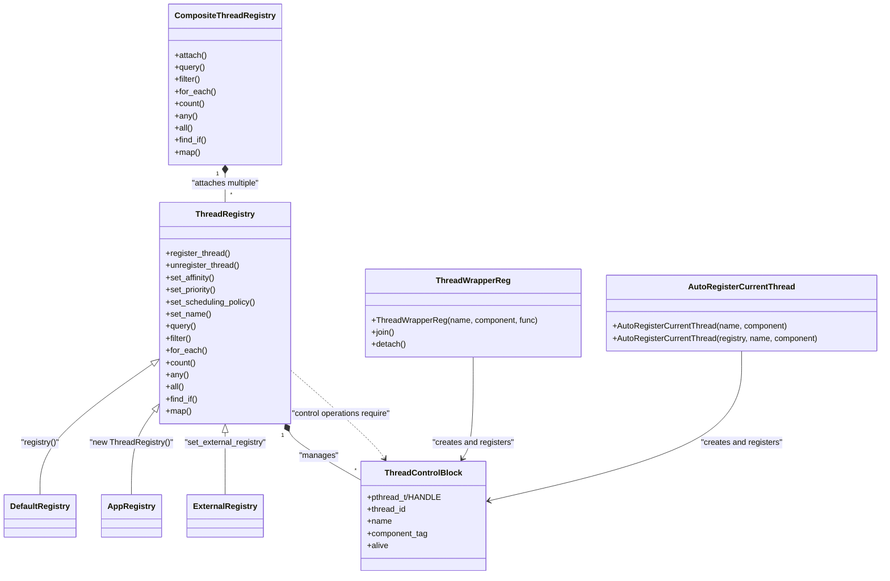
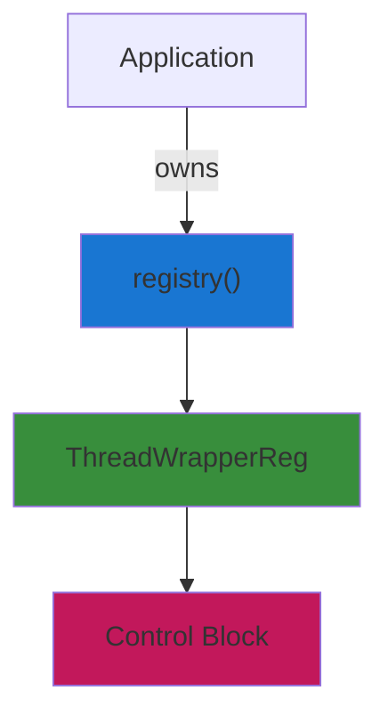
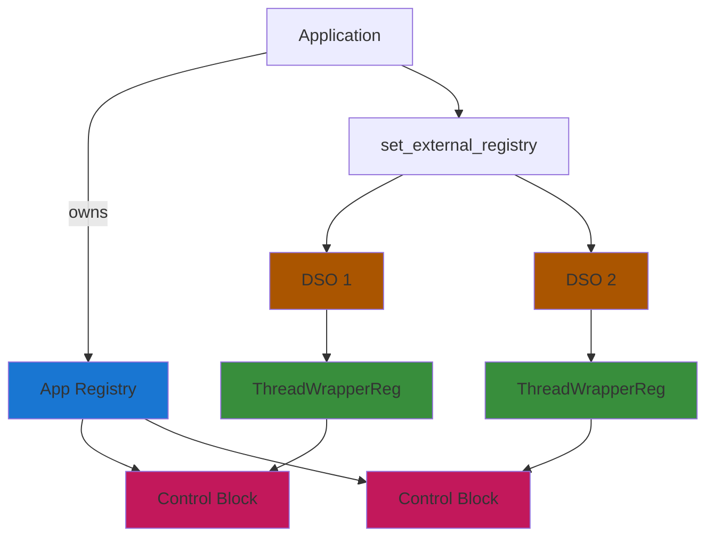
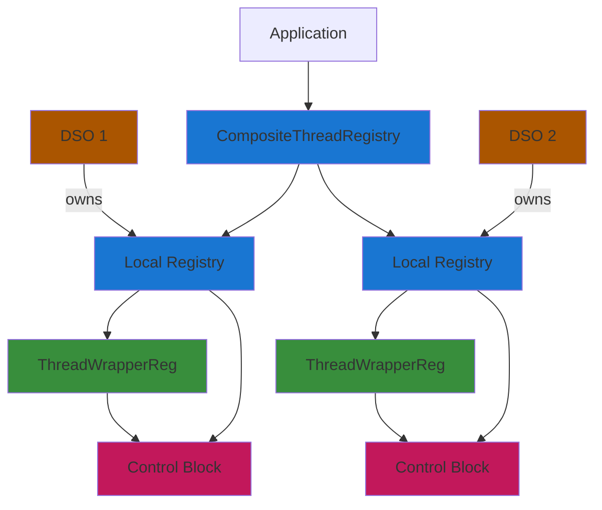
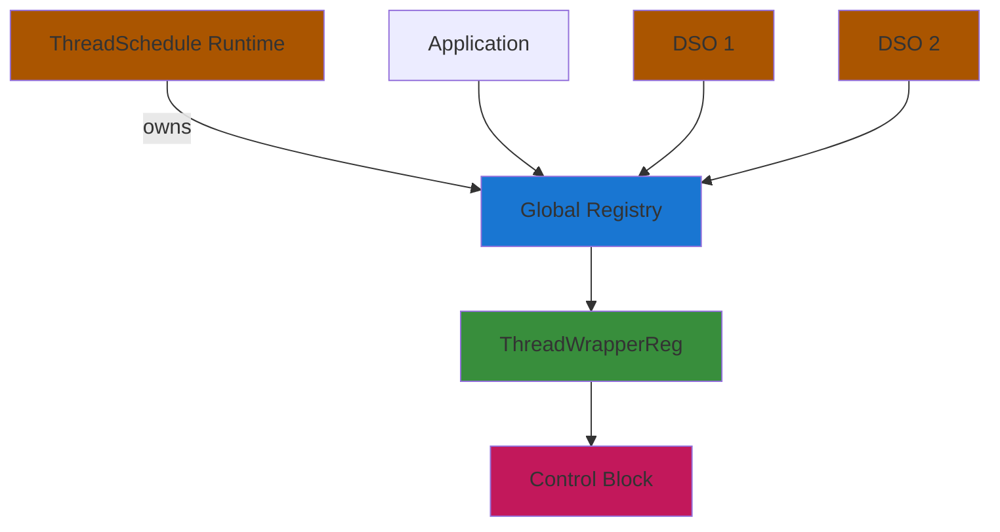
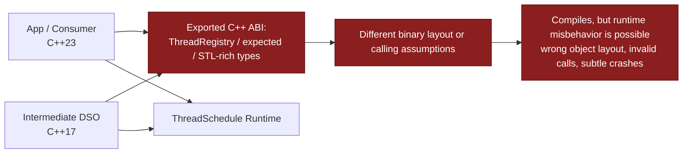
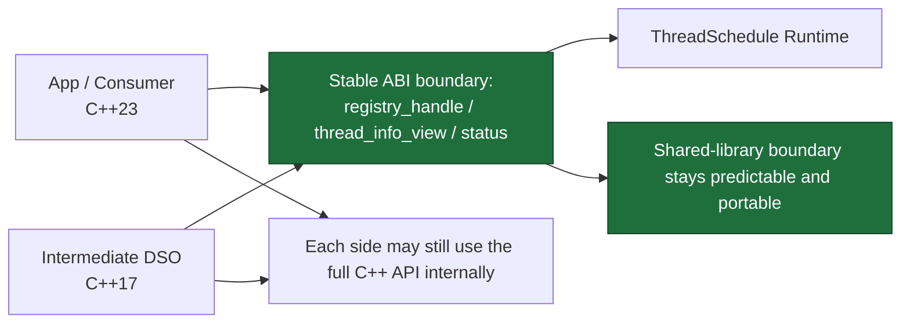
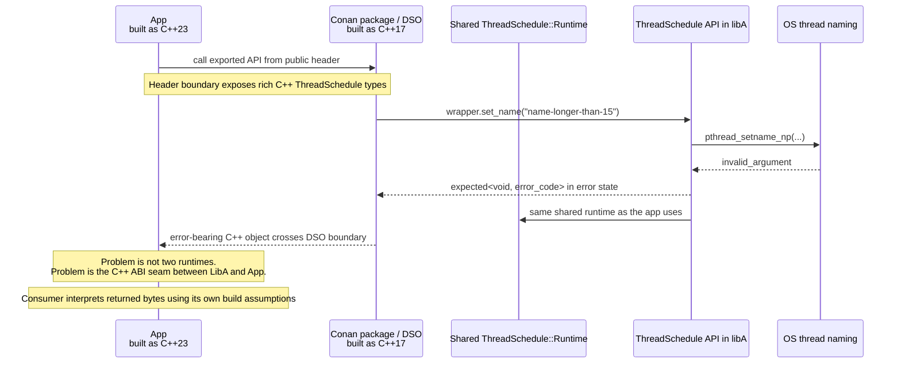
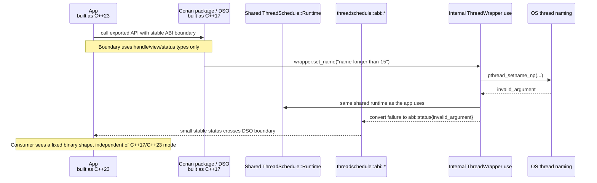

## Thread Registry Usage Guide

This guide explains how to use the process-wide thread registry in common scenarios, including multiple shared libraries (DSOs) using ThreadSchedule.

### What is the registry?

The registry provides a process-wide view of running threads and APIs to control them (affinity, priority, scheduling policy, name). It is header-only by default (with an optional shared runtime), opt-in, and compatible with both Linux and Windows.

### Registry Architecture Overview


```mermaid
classDiagram
    class ThreadRegistry {
        +register_thread()
        +unregister_thread()
        +set_affinity()
        +set_priority()
        +set_scheduling_policy()
        +set_name()
        +query()
        +filter()
        +for_each()
        +count()
        +any()
        +all()
        +find_if()
        +map()
    }

    class CompositeThreadRegistry {
        +attach()
        +query()
        +filter()
        +for_each()
        +count()
        +any()
        +all()
        +find_if()
        +map()
    }

    class ThreadControlBlock {
        +pthread_t/HANDLE
        +thread_id
        +name
        +component_tag
        +alive
    }

    class ThreadWrapperReg {
        +ThreadWrapperReg(name, component, func)
        +join()
        +detach()
    }

    class AutoRegisterCurrentThread {
        +AutoRegisterCurrentThread(name, component)
        +AutoRegisterCurrentThread(registry, name, component)
    }

    %% Creation patterns
    ThreadRegistry <|-- DefaultRegistry : "registry()"
    ThreadRegistry <|-- AppRegistry : "new ThreadRegistry()"
    ThreadRegistry <|-- ExternalRegistry : "set_external_registry"

    %% Registry relationships
    CompositeThreadRegistry "1" *-- "*" ThreadRegistry : "attaches multiple"

    %% Thread registration
    ThreadRegistry "1" *-- "*" ThreadControlBlock : "manages"
    ThreadWrapperReg --> ThreadControlBlock : "creates and registers"
    AutoRegisterCurrentThread --> ThreadControlBlock : "creates and registers"

    %% Control operations require control blocks
    ThreadRegistry ..> ThreadControlBlock : "control operations require"
```

**Key Components:**

- **ThreadRegistry**: Core registry implementation that manages thread information and control operations
- **CompositeThreadRegistry**: Merges multiple registries into a unified view (useful for multiple DSOs)
- **ThreadControlBlock**: Platform-specific control structure (pthread_t on Linux, HANDLE on Windows)
- **ThreadWrapperReg**: Thread wrapper that automatically creates and registers control blocks
- **AutoRegisterCurrentThread**: RAII helper for registering existing threads

**Creation Patterns:**
- **Default Registry**: `registry()` returns a singleton instance
- **App Registry**: `new ThreadRegistry()` creates application-owned instance
- **External Registry**: `set_external_registry` injects app registry as global
- **Runtime Registry**: Shared library provides single process-wide instance

### Usage Scenarios

#### 1. Single Application


```mermaid
graph TD
    A[Application]
    D1["registry()"]
    T1[ThreadWrapperReg]
    CB1["Control Block"]

    A --> |owns| D1
    D1 --> T1
    T1 --> CB1

    classDef registry fill:#1976d2
    classDef controlBlock fill:#c2185b
    classDef wrapper fill:#388e3c

    class D1 registry
    class CB1 controlBlock
    class T1 wrapper
```

**Pattern**: Direct use of `registry()` singleton

#### 2. Multiple DSOs - App Injection


```mermaid
graph TD
    App[Application]
    AR["App Registry"]
    ER1["set_external_registry"]
    DSO1["DSO 1"]
    DSO2["DSO 2"]
    T2[ThreadWrapperReg]
    T3[ThreadWrapperReg]
    CB2["Control Block"]
    CB3["Control Block"]

    App --> |owns| AR
    App --> ER1
    ER1 --> DSO1
    ER1 --> DSO2
    DSO1 --> T2
    DSO2 --> T3
    T2 --> CB2
    T3 --> CB3
    AR --> CB2
    AR --> CB3

    classDef registry fill:#1976d2
    classDef controlBlock fill:#c2185b
    classDef wrapper fill:#388e3c
    classDef lib fill:#aa5500

    class DSO1,DSO2 lib
    class AR registry
    class CB2,CB3 controlBlock
    class T2,T3 wrapper
```

**Pattern**: App creates registry, injects into all DSOs via `set_external_registry`

#### 3. Multiple DSOs - Composite Registry


```mermaid
graph TD
    App2[Application]
    CR[CompositeThreadRegistry]
    L1["DSO 1"]
    L2["DSO 2"]
    R1["Local Registry"]
    R2["Local Registry"]
    T4[ThreadWrapperReg]
    T5[ThreadWrapperReg]
    CB4["Control Block"]
    CB5["Control Block"]

    App2 --> CR
    L1 --> |owns| R1
    CR --> R1
    CR --> R2
    L2 --> |owns| R2
    R1 --> T4
    R2 --> T5
    T4 --> CB4
    T5 --> CB5
    R1 --> CB4
    R2 --> CB5

    classDef registry fill:#1976d2
    classDef controlBlock fill:#c2185b
    classDef wrapper fill:#388e3c
    classDef lib fill:#aa5500

    class L1,L2 lib
    class CR,R1,R2 registry
    class CB4,CB5 controlBlock
    class T4,T5 wrapper
```

**Pattern**: Each DSO has isolated registry, app merges views with `CompositeThreadRegistry`

**Note**: Uses `ThreadWrapperReg` for automatic thread registration in each DSO's local registry

#### 4. Runtime Mode


```mermaid
graph TD
    RT["ThreadSchedule Runtime"]
    GR["Global Registry"]
    App3[Application]
    DSO3["DSO 1"]
    DSO4["DSO 2"]
    T6[ThreadWrapperReg]
    CB6["Control Block"]

    RT --> |owns| GR
    App3 --> GR
    DSO3 --> GR
    DSO4 --> GR
    GR --> T6
    T6 --> CB6

    classDef registry fill:#1976d2
    classDef lib fill:#aa5500
    classDef controlBlock fill:#c2185b
    classDef wrapper fill:#388e3c
    classDef runtime fill:#aa5500

    class DSO3,DSO4 lib
    class GR registry
    class CB6 controlBlock
    class T6 wrapper
    class RT runtime
```

**Pattern**: Shared library provides single process-wide registry

### Timeline:
- **Header-only Mode**: Default registry created on first `registry()` call
- **Runtime Mode**: Shared runtime created at startup, provides global registry instance

- Core entrypoints:
  - `threadschedule::registry()` - default global registry
  - `threadschedule::set_external_registry(...)` - app-injected global registry
  - `threadschedule::CompositeThreadRegistry` - merge multiple registries (views)
  - `threadschedule::AutoRegisterCurrentThread` - RAII auto-registration
  - `threadschedule::ThreadWrapperReg` - opt-in wrapper that auto-registers

**Important:** The registry **requires control blocks** for all control operations (`set_affinity`, `set_priority`, `set_scheduling_policy`, `set_name`). Threads registered without control blocks can be queried but not controlled. Use `ThreadWrapperReg` or `AutoRegisterCurrentThread` to automatically create and register control blocks.

### When to use which pattern?

- Single app, single shared ThreadSchedule: Use `registry()` directly. Create `ThreadWrapperReg` threads or use `AutoRegisterCurrentThread` in worker entry.
- App with multiple DSOs that also include ThreadSchedule:
  - Preferred: Ensure all components link against the same `libthreadschedule` (shared). `registry()` resolves to the same instance.
  - If components statically include ThreadSchedule: Use `set_external_registry(&appRegistry)` in `main()` and register threads to that instance everywhere.
  - If isolated registries are desired for components: Each component uses its own `ThreadRegistry`, and the app merges them using `CompositeThreadRegistry`.

### Stable ABI subset for DSO and plugin boundaries

If a shared library, plugin, or intermediate wrapper library exports
ThreadSchedule-related types in its own ABI, treat the normal registry API as a
source-level API, not as a stable binary contract. This matters especially when
different components may be built in different language modes, for example one
DSO as C++17 and another as C++23.

Use the `threadschedule::abi::*` surface when all of these are true:

- components cross a shared-library boundary
- components may be built with different language modes or standard library
  configurations
- the boundary needs registry access or thread auto-registration

The stable ABI subset is intentionally small and C-like:

- `threadschedule::abi::registry_handle`
- `threadschedule::abi::string_ref`
- `threadschedule::abi::status` / `status_code`
- `threadschedule::abi::thread_info_view`
- `threadschedule::abi::thread_info_callback`
- `threadschedule::abi::create_registry()`, `destroy_registry(...)`,
  `current_registry()`, `set_external_registry(...)`,
  `registry_for_each(...)`, `register_current_thread(...)`,
  `unregister_current_thread(...)`
- `threadschedule::abi::AutoRegisterCurrentThread`

Do not export these runtime-oriented C++ types as part of your own DSO ABI:

- `ThreadRegistry` or `ThreadRegistry*`
- `RegisteredThreadInfo`
- `AutoRegisterCurrentThread`
- callbacks or virtual interfaces that embed those types, `std::string`, or
  other STL-heavy registry payloads directly in the exported signature

Build-time migration helpers:

- `THREADSCHEDULE_RUNTIME=ON` enables the shared runtime that backs the stable
  ABI entrypoints.
- `THREADSCHEDULE_STABLE_ABI=ON` keeps the legacy runtime API available but
  marks `registry()`, `set_external_registry(ThreadRegistry*)`, and
  `AutoRegisterCurrentThread` as deprecated for DSO boundaries.
- `THREADSCHEDULE_STABLE_ABI_STRICT=ON` rejects those legacy runtime entrypoints
  at compile time and forces use of `threadschedule::abi::*`.

Use `THREADSCHEDULE_VALIDATE_STABLE_ABI_EXPORT(...)` to keep exported
signatures honest:

```cpp
#include <threadschedule/abi.hpp>

THREADSCHEDULE_VALIDATE_STABLE_ABI_EXPORT(
    void,
    ::threadschedule::abi::registry_handle,
    ::threadschedule::abi::thread_info_callback,
    void*);

// This would fail the static_assert:
// THREADSCHEDULE_VALIDATE_STABLE_ABI_EXPORT(void, ::threadschedule::ThreadRegistry*);
```

Typical plugin pattern:

```cpp
#include <threadschedule/abi.hpp>
#include <thread>

extern "C" void plugin_set_registry(threadschedule::abi::registry_handle handle)
{
    threadschedule::abi::set_external_registry(handle);
}

extern "C" void plugin_start_worker()
{
    std::thread([] {
        threadschedule::abi::AutoRegisterCurrentThread guard("plugin-worker", "plugin");
        // ... work ...
    }).detach();
}
```

This keeps the boundary on opaque handles, views, and callbacks while the
implementation still uses the full C++ API internally.

### Why this matters visually

For C++ newcomers: ABI means the binary-level contract between separately built
parts of a program. If one DSO thinks a type looks one way and another DSO
thinks it looks slightly differently, the code may still compile but can break
at runtime.

#### Without the stable ABI subset

Here the library boundary exports ThreadSchedule C++ types directly. That is
fragile when the middle library and the final executable are built with
different standards, standard library versions, or compiler settings.


```mermaid
flowchart LR
    App["App / Consumer<br>C++23"]
    Mid["Intermediate DSO<br>C++17"]
    Runtime["ThreadSchedule Runtime"]
    ABI["Exported C++ ABI:<br>ThreadRegistry / expected / STL-rich types"]
    Drift["Different binary layout or calling assumptions"]
    Result["Compiles, but runtime misbehavior is possible<br>wrong object layout, invalid calls, subtle crashes"]

    App --> ABI
    Mid --> ABI
    Mid --> Runtime
    App --> Runtime
    ABI --> Drift
    Drift --> Result

    classDef bad fill:#8b1e1e,color:#ffffff,stroke:#5c1010
    class ABI,Drift,Result bad
```

Typical failure mode:

- the intermediate DSO exports a type like `threadschedule::expected` or
  `ThreadRegistry*` in its own ABI
- another component was built under a different language mode and interprets
  that exported type with different binary assumptions
- the handoff crosses the shared-library boundary and undefined behavior starts

#### With `threadschedule::abi::*`

Here the boundary stays on simple handles, views, callbacks, and status codes.
Those are intentionally small and stable so each side agrees on the binary
shape even if they were built differently.


```mermaid
flowchart LR
    App2["App / Consumer<br>C++23"]
    Mid2["Intermediate DSO<br>C++17"]
    Runtime2["ThreadSchedule Runtime"]
    Stable["Stable ABI boundary:<br>registry_handle / thread_info_view / status"]
    Internal["Each side may still use the full C++ API internally"]
    Safe["Shared-library boundary stays predictable and portable"]

    App2 --> Stable
    Mid2 --> Stable
    Stable --> Runtime2
    Mid2 --> Internal
    App2 --> Internal
    Stable --> Safe

    classDef good fill:#1f6f3d,color:#ffffff,stroke:#124628
    class Stable,Safe good
```

Mental model:

- use the full ThreadSchedule C++ API inside one binary that you build
  together
- use `threadschedule::abi::*` only at the seam between separately built
  binaries
- once the boundary is reduced to opaque handles and plain views, the runtime
  can do the complex C++ work behind that seam safely

#### Concrete mixed-standard Conan scenario

This is the kind of failure that motivated the stable ABI work:

- there is only one shared `ThreadSchedule::Runtime` in the process
- `libA` is consumed as a Conan package and was built earlier as C++17
- your application is built as C++23
- `libA` exposes richer ThreadSchedule-adjacent C++ types in public headers,
  for example a struct that contains `ThreadWrapper` or APIs that surface
  ThreadSchedule result types directly
- inside `libA`, `ThreadWrapper::set_name(...)` is called

On Linux, thread names longer than 15 characters fail with
`invalid_argument`. That means the bug may stay hidden for a long time and only
become visible when the code takes the error path.


```mermaid
sequenceDiagram
    participant App as App<br/>built as C++23
    participant LibA as Conan package / DSO<br/>built as C++17
    participant RT as Shared ThreadSchedule::Runtime
    participant TS as ThreadSchedule API in libA
    participant OS as OS thread naming

    App->>LibA: call exported API from public header
    Note over App,LibA: Header boundary exposes rich C++ ThreadSchedule types
    LibA->>TS: wrapper.set_name("name-longer-than-15")
    TS->>OS: pthread_setname_np(...)
    OS-->>TS: invalid_argument
    TS-->>LibA: expected<void, error_code> in error state
    TS->>RT: same shared runtime as the app uses
    LibA-->>App: error-bearing C++ object crosses DSO boundary
    Note over App: Problem is not two runtimes.<br/>Problem is the C++ ABI seam between LibA and App.
    Note over App: Consumer interprets returned bytes using its own build assumptions
```

Why this was so confusing in practice:

- short names often stayed on the success path, so nothing obviously broke
- the failure only appeared once the long-name validation forced an error value
- because the boundary was a rich C++ ABI, the visible symptom appeared far
  away from the real design mistake

The stable ABI version of the same flow looks like this:


```mermaid
sequenceDiagram
    participant App2 as App<br/>built as C++23
    participant LibA2 as Conan package / DSO<br/>built as C++17
    participant RT2 as Shared ThreadSchedule::Runtime
    participant ABI as threadschedule::abi::*
    participant Impl as Internal ThreadWrapper use
    participant OS2 as OS thread naming

    App2->>LibA2: call exported API with stable ABI boundary
    Note over App2,LibA2: Boundary uses handle/view/status types only
    LibA2->>Impl: wrapper.set_name("name-longer-than-15")
    Impl->>OS2: pthread_setname_np(...)
    OS2-->>Impl: invalid_argument
    Impl->>RT2: same shared runtime as the app uses
    Impl-->>ABI: convert failure to abi::status{invalid_argument}
    ABI-->>App2: small stable status crosses DSO boundary
    Note over App2: Consumer sees a fixed binary shape, independent of C++17/C++23 mode
```

Important nuance:

- the recent `threadschedule::expected` hardening removes one concrete source
  of standard-mode drift
- the stable ABI subset is still needed because types like `ThreadWrapper`,
  `ThreadRegistry`, and STL-heavy exported structs remain poor DSO boundary
  types even after `expected` is fixed

### Header-only builds and multiple DSOs

Because ThreadSchedule is header-only, each DSO that includes it may get its own internal `registry()` singleton. To obtain a unified process-wide view, use one of these patterns:

- App injection (unify to a single app-owned registry)
  - The app creates a `ThreadRegistry appReg;` and injects it into itself and into every DSO using a small setter exported by each DSO.

DSO side (libX):

```cpp
// libX_api.cpp
#include <threadschedule/thread_registry.hpp>
using namespace threadschedule;

// Allow the host application to inject a registry pointer
void libX_set_registry(ThreadRegistry* reg) {
  set_external_registry(reg);
}
```

App side:

```cpp
#include <threadschedule/thread_registry.hpp>
using namespace threadschedule;

// From each DSO's public header
void libA_set_registry(ThreadRegistry*);
void libB_set_registry(ThreadRegistry*);

int main() {
  ThreadRegistry appReg;
  // App uses the same registry for its own calls
  set_external_registry(&appReg);
  // Propagate the same pointer into all DSOs
  libA_set_registry(&appReg);
  libB_set_registry(&appReg);
  // ... start threads in app and DSOs ...
}
```

- Composite merge (keep DSOs isolated and merge views in the app)
  - Each DSO exposes `ThreadRegistry& libX_registry();` and registers its threads into that local registry. The app builds a `CompositeThreadRegistry` and attaches all of them. See example below.

- Dynamic discovery (no headers)
  - On POSIX, you can `dlsym` exported symbols (e.g., `libX_registry`, `libX_set_registry`) from each DSO at runtime and call them to either attach or inject a registry pointer.

### Single shared runtime (optional, non header-only mode)

If you prefer a single, process-wide registry without app-side injection or composite merging, enable the runtime option. This builds a shared library that owns the global registry and exports the required symbols.

- Enable in CMake:

```bash
cmake -B build -DTHREADSCHEDULE_RUNTIME=ON
cmake --build build
```

- Link your app and DSOs against the runtime target:

```cmake
target_link_libraries(your_app PRIVATE ThreadSchedule::ThreadSchedule ThreadSchedule::Runtime)
target_link_libraries(your_dso PRIVATE ThreadSchedule::ThreadSchedule ThreadSchedule::Runtime)
```

- Exported APIs (same as header-only), provided by the runtime:
  - `threadschedule::registry()` - returns the single process-wide registry instance
  - `threadschedule::set_external_registry(ThreadRegistry*)` - optionally redirect runtime to an app-owned instance
  - `threadschedule::abi::*` helpers - stable handle/view/callback surface for
    plugin and DSO boundaries

Notes:
- With `THREADSCHEDULE_RUNTIME=ON`, the header declares these functions and the `.so/.dll` provides the definitions.
- This ensures all components in the process resolve to the same registry object as long as they link to the runtime.
- You can still call `set_external_registry(&appReg)` early in `main()` to make the app’s instance authoritative.
- If your own shared-library ABI exposes ThreadSchedule-related registry access,
  prefer `threadschedule::abi::*` over the legacy C++ runtime API.

### Examples

#### 1) Basic app usage with the default registry

**New chainable API (recommended):**
```cpp
#include <threadschedule/registered_threads.hpp>
#include <threadschedule/thread_registry.hpp>
using namespace threadschedule;

int main() {
  ThreadWrapperReg t1("worker-1","io", []{ /* work */ });
  ThreadWrapperReg t2("worker-2","compute", []{ /* work */ });
  
  // Filter and apply
  registry()
    .filter([](const RegisteredThreadInfo& e){ return e.componentTag == "io"; })
    .for_each([&](const RegisteredThreadInfo& e){ 
      (void)registry().set_priority(e.tid, ThreadPriority{0}); 
    });
  
  // Count
  auto io_count = registry()
                   .filter([](const RegisteredThreadInfo& e){ return e.componentTag == "io"; })
                   .count();
  auto total = registry().count();
  
  // Predicate checks
  bool has_io = registry().any([](auto& e){ return e.componentTag == "io"; });
  bool all_alive = registry().all([](auto& e){ return e.alive; });
  
  // Find specific thread
  auto found = registry().find_if([](auto& e){ return e.name == "worker-1"; });
  
  // Map - extract TIDs
  auto tids = registry().filter([](auto& e){ return e.componentTag == "io"; })
                        .map([](auto& e){ return e.tid; });
  
  // Take/Skip - pagination
  registry().query().take(10).for_each([](auto& e){ /* ... */ });
  
  t1.join();
  t2.join();
}
```

**Legacy API (still supported):**
```cpp
registry().apply(
  [](const RegisteredThreadInfo& e){ return e.componentTag=="io"; },
  [&](const RegisteredThreadInfo& e){ (void)registry().set_priority(e.tid, ThreadPriority{0}); }
);
```

#### 2) App-owned global registry (injection)

**With DSO injection support:**

libX (compiled into `libX.so`):

```cpp
// libX.cpp
#include <threadschedule/thread_registry.hpp>
#include <threadschedule/thread_wrapper.hpp>
using namespace threadschedule;

// Allow the host application to inject a registry pointer
void libX_set_registry(ThreadRegistry* reg) {
  set_external_registry(reg);
}

// start function used by the app
void libX_start() {
  ThreadWrapper t([]{
    AutoRegisterCurrentThread guard("x-worker","X");
    // ... work ...
  });
  t.detach();
}
```

App side:

```cpp
#include <threadschedule/thread_registry.hpp>
using namespace threadschedule;

// From each DSO's public header
void libA_set_registry(ThreadRegistry*);

int main() {
  ThreadRegistry appReg;
  set_external_registry(&appReg);

  // Inject the same registry into DSOs
  libA_set_registry(&appReg);

  libA_start();
  // Now libA threads are registered in appReg
}
```

#### 3) Multiple DSOs with isolated registries, merged by the app

In each DSO, define and expose a local `ThreadRegistry` accessor. Threads inside the DSO register to that local registry.

libA (compiled into `libA.so`):

```cpp
// libA.cpp
#include <threadschedule/thread_registry.hpp>
#include <threadschedule/thread_wrapper.hpp>
using namespace threadschedule;

static ThreadRegistry regA;

// exported accessor (C++ symbol if you ship a header)
ThreadRegistry& libA_registry() {
  return regA;
}

// start function used by the app
void libA_start() {
  ThreadWrapper t([]{
    AutoRegisterCurrentThread guard(regA, "a-1","A");
    // ... work ...
  });
  t.detach();
}
```

libB (compiled into `libB.so`) is analogous:

```cpp
// libB.cpp
#include <threadschedule/thread_registry.hpp>
#include <threadschedule/thread_wrapper.hpp>
using namespace threadschedule;

static ThreadRegistry regB;

ThreadRegistry& libB_registry() {
  return regB;
}

void libB_start() {
  ThreadWrapper t([]{
    AutoRegisterCurrentThread guard(regB, "b-1","B");
    // ... work ...
  });
  t.detach();
}
```

In the app, include the DSOs' headers (recommended) and merge via `CompositeThreadRegistry`:

**New chainable API (recommended):**
```cpp
// app.cpp
#include <threadschedule/thread_registry.hpp>
using namespace threadschedule;

// from libA_api.hpp and libB_api.hpp provided by the DSOs
ThreadRegistry& libA_registry();
ThreadRegistry& libB_registry();
void libA_start();
void libB_start();

int main() {
  libA_start();
  libB_start();

  CompositeThreadRegistry composite;
  composite.attach(&libA_registry());
  composite.attach(&libB_registry());

  // Query all threads across both registries - direct call
  auto total = composite.count();
  
  // Filter and apply operations - direct .filter() call
  composite
    .filter([](const RegisteredThreadInfo& e){ return e.componentTag == "A"; })
    .for_each([&](const RegisteredThreadInfo& e){ 
      (void)registry().set_priority(e.tid, ThreadPriority::highest()); 
    });
}
```

**Legacy API (still supported):**
```cpp
composite.apply(
  [](const RegisteredThreadInfo&){ return true; },
  [&](const RegisteredThreadInfo& e){ (void)registry().set_priority(e.tid, ThreadPriority{0}); }
);
```

#### 4) Registering foreign threads without using wrappers

```cpp
void foreign_thread() {
  AutoRegisterCurrentThread guard("foreign","misc");
  // ... work ...
}
```

#### 5) Runtime (shared) example - app + two DSOs

This repository includes a minimal working example under `examples/runtime_shared/` that demonstrates using `THREADSCHEDULE_RUNTIME`:

- Targets: `runtime_libA` (DSO), `runtime_libB` (DSO), `runtime_main` (app)
- All are linked against `ThreadSchedule::Runtime` so they share one process-wide registry.

Key snippets:

libA (`examples/runtime_shared/libA.cpp`):

```cpp
#include <threadschedule/thread_registry.hpp>
#include <threadschedule/thread_wrapper.hpp>
using namespace threadschedule;

void libA_start() {
  ThreadWrapper t([]{
    AutoRegisterCurrentThread guard("rt-a1","A");
    std::this_thread::sleep_for(std::chrono::milliseconds(100));
  });
  t.detach();
}
```

libB is analogous.

App (`examples/runtime_shared/main.cpp`):

```cpp
#include <threadschedule/thread_registry.hpp>
using namespace threadschedule;

void libA_start();
void libB_start();
int main(){
  libA_start();
  libB_start();
  std::this_thread::sleep_for(std::chrono::milliseconds(30));
  int count = 0;
  registry().for_each([&](const RegisteredThreadInfo&){ count++; });
  return count > 0 ? 0 : 1;
}
```

Build:

```bash
cmake -B build -DTHREADSCHEDULE_RUNTIME=ON -DTHREADSCHEDULE_BUILD_EXAMPLES=ON
cmake --build build --target runtime_main
```

Run `runtime_main` - it will list threads from both DSOs via the single shared registry.

### Platform notes

- Linux: Control operations use `pthread_*` APIs via control blocks.
- Windows: Control operations use duplicated `HANDLE`s stored in control blocks.

**Control blocks are mandatory:** All registry control operations require threads to be registered with control blocks. If a thread is registered without a control block, control operations will fail with `std::errc::no_such_process`.

### Error handling

All control functions return `expected<void, std::error_code>`. Typical errors include:
- `std::errc::no_such_process` - Thread not found in registry or no control block available
- `std::errc::operation_not_permitted` - Insufficient privileges
- `std::errc::invalid_argument` - Invalid parameters


### Duplicate registrations

- Registering the same thread more than once is safe and idempotent.
- If a thread with the same TID is already present in the registry, subsequent registrations are a no-op.
- Semantics: The first registration wins; existing fields (name, component tag, control block) are not overwritten by later calls.

- System integration hooks:
  - `registry().set_on_register([](const RegisteredThreadInfo& e){ /* e.tid, e.name, e.componentTag */ });`
  - `registry().set_on_unregister([](const RegisteredThreadInfo& e){ /* cleanup */ });`
  - Use hooks to integrate with external systems (e.g., attach to cgroups on Linux, adjust QoS, logging).

- Linux cgroup helper (best-effort):
  - `cgroup_attach_tid("/sys/fs/cgroup/mygroup", e.tid)` attempts to write the TID into common cgroup files (`cgroup.threads`, `tasks`, `cgroup.procs`).
  - Requires appropriate privileges; returns `operation_not_permitted` on failure.
