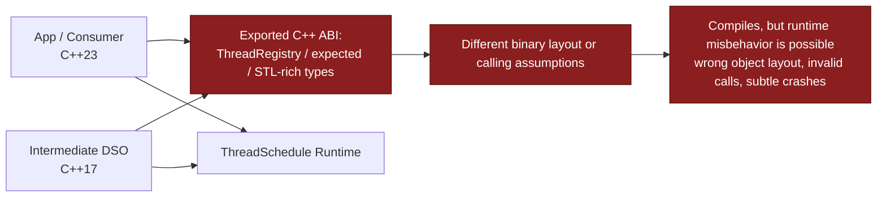
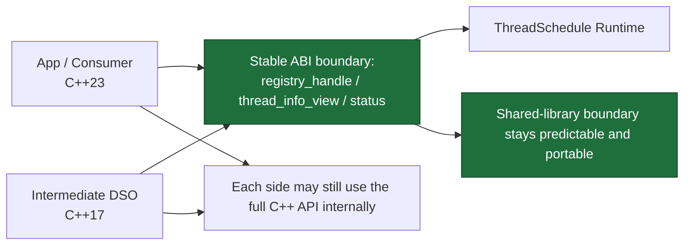
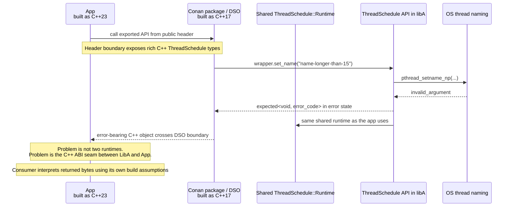

# Stable ABI for DSO and Plugin Boundaries

This guide explains when to use the `threadschedule::abi::*` surface, why the
normal C++ registry API is not a stable binary boundary, and what can go wrong
when richer C++ objects cross DSOs compiled under different assumptions.

For the broader registry usage guide, see [REGISTRY.md](./REGISTRY.md).

## When to use the stable ABI subset

If a shared library, plugin, or intermediate wrapper library exports
ThreadSchedule-related types in its own ABI, treat the normal registry API as a
source-level API, not as a stable binary contract. This matters especially when
different components may be built in different language modes, for example one
DSO as C++17 and another as C++23.

Use the `threadschedule::abi::*` surface when all of these are true:

- components cross a shared-library boundary
- components may be built with different language modes or standard library
  configurations
- the boundary needs registry access or thread auto-registration

## Stable ABI subset

The stable ABI subset is intentionally small and C-like:

- `threadschedule::abi::registry_handle`
- `threadschedule::abi::string_ref`
- `threadschedule::abi::status` / `status_code`
- `threadschedule::abi::thread_info_view`
- `threadschedule::abi::thread_info_callback`
- `threadschedule::abi::create_registry()`, `destroy_registry(...)`,
  `current_registry()`, `set_external_registry(...)`,
  `registry_for_each(...)`, `register_current_thread(...)`,
  `unregister_current_thread(...)`
- `threadschedule::abi::AutoRegisterCurrentThread`

Do not export these runtime-oriented C++ types as part of your own DSO ABI:

- `ThreadRegistry` or `ThreadRegistry*`
- `RegisteredThreadInfo`
- `AutoRegisterCurrentThread`
- callbacks or virtual interfaces that embed those types, `std::string`, or
  other STL-heavy registry payloads directly in the exported signature

## Build-time migration helpers

- `THREADSCHEDULE_RUNTIME=ON` enables the shared runtime that backs the stable
  ABI entrypoints.
- `THREADSCHEDULE_STABLE_ABI=ON` keeps the legacy runtime API available but
  marks `registry()`, `set_external_registry(ThreadRegistry*)`, and
  `AutoRegisterCurrentThread` as deprecated for DSO boundaries.
- `THREADSCHEDULE_STABLE_ABI_STRICT=ON` rejects those legacy runtime entrypoints
  at compile time and forces use of `threadschedule::abi::*`.

Use `THREADSCHEDULE_VALIDATE_STABLE_ABI_EXPORT(...)` to keep exported
signatures honest:

```cpp
#include <threadschedule/abi.hpp>

THREADSCHEDULE_VALIDATE_STABLE_ABI_EXPORT(
    void,
    ::threadschedule::abi::registry_handle,
    ::threadschedule::abi::thread_info_callback,
    void*);

// This would fail the static_assert:
// THREADSCHEDULE_VALIDATE_STABLE_ABI_EXPORT(void, ::threadschedule::ThreadRegistry*);
```

## Typical plugin pattern

```cpp
#include <threadschedule/abi.hpp>
#include <thread>

extern "C" void plugin_set_registry(threadschedule::abi::registry_handle handle)
{
    threadschedule::abi::set_external_registry(handle);
}

extern "C" void plugin_start_worker()
{
    std::thread([] {
        threadschedule::abi::AutoRegisterCurrentThread guard("plugin-worker", "plugin");
        // ... work ...
    }).detach();
}
```

This keeps the boundary on opaque handles, views, and callbacks while the
implementation still uses the full C++ API internally.

## Byte-level mental model

If you want to reason about the stable ABI at the "what exact bytes cross the
DSO boundary?" level, think in terms of tiny POD-like packets, not C++ objects
with hidden allocator or vtable state.

Important scope note:

- the stable ABI is for separately built binaries that target the same platform
  ABI, for example 64-bit little-endian Linux
- it is not a promise that a 32-bit build and a 64-bit build have identical
  layouts
- the examples below assume a typical 64-bit build with 8-byte pointers,
  8-byte `std::size_t`, and 4-byte `Tid`

At that level, the core stable ABI types look like this:

```cpp
struct registry_handle {
    void* opaque;                // 8 bytes on a typical 64-bit build
};

enum class status_code : std::uint32_t {
    ok = 0,
    invalid_argument = 1,
    runtime_error = 2,
};

struct status {
    status_code code;            // 4 bytes
};

struct string_ref {
    char const* data;            // pointer to bytes owned elsewhere
    std::size_t size;            // byte count, not including any trailing NUL
};

struct thread_info_view {
    Tid tid;                     // usually 4 bytes
    string_ref name;             // pointer + size
    string_ref component_tag;    // pointer + size
    std::uint8_t alive;          // 0 or 1
    std::uint8_t has_control_block; // 0 or 1
    std::uint8_t reserved[6];    // currently zeroed
};
```

What does that mean in memory?

`registry_handle` is just an opaque pointer-sized value. On a 64-bit build, a
handle might look like:

```text
offset  bytes
0x00    80 4a 37 91 fc 7f 00 00   -> opaque = 0x00007ffc91374a80
```

The consumer must not interpret that address as a `ThreadRegistry` object. It
only stores the pointer and passes it back into other `threadschedule::abi::*`
entrypoints.

`status` is even smaller. Because `status_code` has an explicit
`std::uint32_t` underlying type, the object is just one 32-bit integer:

```text
status{status_code::ok}               -> 00 00 00 00
status{status_code::invalid_argument} -> 01 00 00 00
status{status_code::runtime_error}    -> 02 00 00 00
```

On little-endian machines, the least significant byte comes first, which is
why `invalid_argument` appears as `01 00 00 00`.

The more interesting case is `thread_info_view`. Suppose the runtime is about
to invoke the callback for this thread:

- `tid = 0x0000162e` (decimal `5678`)
- `name = "io-7"` (4 bytes)
- `component_tag = "plugin"` (6 bytes)
- `alive = true`
- `has_control_block = true`

The runtime bridge constructs it like this:

```cpp
::threadschedule::abi::thread_info_view view{
    info.tid,
    {info.name.data(), info.name.size()},
    {info.componentTag.data(), info.componentTag.size()},
    static_cast<std::uint8_t>(info.alive ? 1U : 0U),
    static_cast<std::uint8_t>(info.control ? 1U : 0U),
    {0, 0, 0, 0, 0, 0},
};
```

On a typical 64-bit little-endian target, the object layout is:

```text
thread_info_view at 0x00007ffc913749f0

offset  size  field
0x00    4     tid
0x04    4     alignment padding
0x08    8     name.data
0x10    8     name.size
0x18    8     component_tag.data
0x20    8     component_tag.size
0x28    1     alive
0x29    1     has_control_block
0x2a    6     reserved
```

One concrete byte dump could look like:

```text
offset  bytes                                        meaning
0x00    2e 16 00 00                                 tid = 0x0000162e
0x04    ?? ?? ?? ??                                 alignment padding
0x08    40 30 10 52 fc 7f 00 00                     name.data = 0x00007ffc52103040
0x10    04 00 00 00 00 00 00 00                     name.size = 4
0x18    48 30 10 52 fc 7f 00 00                     component_tag.data = 0x00007ffc52103048
0x20    06 00 00 00 00 00 00 00                     component_tag.size = 6
0x28    01                                          alive = true
0x29    01                                          has_control_block = true
0x2a    00 00 00 00 00 00                          reserved bytes
```

The pointed-to string bytes live somewhere else:

```text
0x00007ffc52103040: 69 6f 2d 37                     "io-7"
0x00007ffc52103048: 70 6c 75 67 69 6e               "plugin"
```

Two details matter here:

- `string_ref` is a borrowed view, not an owning string. The ABI object
  contains a pointer and a byte count, nothing more.
- the bytes are not required to be NUL-terminated. `"io-7"` crosses the
  boundary as exactly 4 bytes, not as a `std::string` object.

At the bit level, the boolean-like flags are intentionally plain one-byte
values:

```text
alive = 1              -> 00000001
has_control_block = 1  -> 00000001
alive = 0              -> 00000000
```

So the callback boundary sees small fixed-width integers instead of compiler-
dependent C++ `bool` layout choices embedded inside a larger exported class.

One more subtle but important point: the `thread_info_view` object itself is a
temporary stack object inside the runtime bridge, and its `name.data` /
`component_tag.data` pointers refer to bytes owned by the underlying registry
entry. That means:

- the callback may read the view during the callback invocation
- if the callback wants to keep the strings or the whole record, it must copy
  them
- consumers must not cache the raw `thread_info_view const*` pointer after the
  callback returns

That is the core design difference from exporting full C++ registry types:

- the stable ABI exports tiny records with explicit fields, sizes, and
  ownership rules
- no `std::string`, no template-instantiated error object, no hidden allocator
  state, no vtable, no exception metadata crosses the boundary
- the complex C++ objects stay inside one binary, and only plain data views
  cross the seam

Once you look at it this way, the value of the stable ABI subset becomes very
concrete: both sides agree on the exact packet shape in memory, even if one
side was built as C++17 and the other as C++23.

## Why this matters visually

For C++ newcomers: ABI means the binary-level contract between separately built
parts of a program. If one DSO thinks a type looks one way and another DSO
thinks it looks slightly differently, the code may still compile but can break
at runtime.

### Without the stable ABI subset

Here the library boundary exports ThreadSchedule C++ types directly. That is
fragile when the middle library and the final executable are built with
different standards, standard library versions, or compiler settings.



Typical failure mode:

- the intermediate DSO exports a type like `threadschedule::expected` or
  `ThreadRegistry*` in its own ABI
- another component was built under a different language mode and interprets
  that exported type with different binary assumptions
- the handoff crosses the shared-library boundary and undefined behavior starts

### With `threadschedule::abi::*`

Here the boundary stays on simple handles, views, callbacks, and status codes.
Those are intentionally small and stable so each side agrees on the binary
shape even if they were built differently.



Mental model:

- use the full ThreadSchedule C++ API inside one binary that you build
  together
- use `threadschedule::abi::*` only at the seam between separately built
  binaries
- once the boundary is reduced to opaque handles and plain views, the runtime
  can do the complex C++ work behind that seam safely

## Concrete mixed-standard Conan scenario

This is the kind of failure that motivated the stable ABI work:

- there is only one shared `ThreadSchedule::Runtime` in the process
- `libA` is consumed as a Conan package and was built earlier as C++17
- your application is built as C++23
- `libA` exposes richer ThreadSchedule-adjacent C++ types in public headers,
  for example a struct that contains `ThreadWrapper` or APIs that surface
  ThreadSchedule result types directly
- inside `libA`, `ThreadWrapper::set_name(...)` is called

On Linux, thread names longer than 15 characters fail with
`invalid_argument`. That means the bug may stay hidden for a long time and only
become visible when the code takes the error path.



Why this was so confusing in practice:

- short names often stayed on the success path, so nothing obviously broke
- the failure only appeared once the long-name validation forced an error value
- because the boundary was a rich C++ ABI, the visible symptom appeared far
  away from the real design mistake

## Byte-level view of the `expected`-style ABI bug

What actually goes wrong at machine level is not "the runtime returned the
wrong value". The problem is: producer and consumer emit code that reads
different offsets from the same returned bytes.

Important precision:

- the exact object layout of `std::expected<void, std::error_code>` is not
  standardized and depends on compiler + standard library implementation
- the example below is illustrative, not a claim about one exact libstdc++ or
  libc++ layout
- the failure mode is real because both sides compile field access into fixed
  byte offsets, and those offsets only work if both sides agree on the layout

Imagine a rich C++ result object crossing the DSO boundary in error state.
Internally it needs to represent at least two things:

- a discriminator: "success or error?"
- an error payload: here some `std::error_code`-like object

One side might effectively lay it out like this:

```text
LibA / producer view of ResultA

offset  size  field
0x00    1     has_value
0x01    3     padding
0x04    4     error.value
0x08    8     error.category_ptr
```

So when `set_name("name-longer-than-15")` fails with `invalid_argument`, LibA
could physically return bytes like:

```text
address  bytes                                      producer meaning
0x00     00                                         has_value = false
0x01     00 00 00                                  padding
0x04     16 00 00 00                               error.value = 22 (EINVAL)
0x08     30 b4 55 91 7a 7f 00 00                   error.category_ptr
```

Now imagine the consumer was built with a different implementation or mode and
compiled code under a different assumption:

```text
App / consumer view of ResultB

offset  size  field
0x00    8     error.category_ptr
0x08    4     error.value
0x0c    1     has_value
0x0d    3     padding
```

The app code then emits loads that are valid for `ResultB`, for example:

```text
load 8 bytes from +0x00  -> expects error.category_ptr
load 4 bytes from +0x08  -> expects error.value
load 1 byte  from +0x0c  -> expects has_value
```

But the actual bytes in memory came from `ResultA`, not `ResultB`. So the app
interprets them like this:

```text
bytes at +0x00: 00 00 00 00 16 00 00 00
consumer reads that as error.category_ptr = 0x0000001600000000   // bogus

bytes at +0x08: 30 b4 55 91
consumer reads that as error.value = 0x9155b430                  // nonsense

byte at +0x0c: 7a
consumer reads that as has_value = true                          // wrong
```

That is the real ABI break:

- LibA wrote correct bytes for the type it compiled
- App read correct offsets for the type it compiled
- the returned byte sequence itself was reinterpreted under the wrong schema

From the CPU's point of view there is no "`expected` object" anymore. There is
only:

- "read 8 bytes at offset 0"
- "read 4 bytes at offset 8"
- "branch depending on byte at offset 12"

If producer and consumer disagree about what lives at those offsets, undefined
behavior starts immediately.

This is why such bugs often look random:

- one build may mostly observe the success path, where only the discriminator
  gets checked
- another build may hit the error path and start dereferencing what it thinks
  is an `error_category*`
- the crash can happen far away from the original failing call because the
  wrongly decoded object may first get copied, logged, or inspected later

The current `threadschedule::expected` hardening exists specifically to avoid
that kind of standard-library-dependent object drift in public APIs. But the
general lesson remains broader: rich C++ result objects are poor DSO boundary
types because the consumer must know their exact byte schema to read them
correctly.

## Important nuance

- the recent `threadschedule::expected` hardening removes one concrete source
  of standard-mode drift
- the stable ABI subset is still needed because types like `ThreadWrapper`,
  `ThreadRegistry`, and STL-heavy exported structs remain poor DSO boundary
  types even after `expected` is fixed
